# NeuroFly: Brain-Body Simulation of *Drosophila melanogaster*

[🇫🇷 Français](README.md) | 🇬🇧 English


*v1 - Odor-only navigation, no visual system*


*v4 - Zigzag wall navigation with channeled odor, flyvis T5 obstacle avoidance, and back camera*

A closed-loop simulation of *Drosophila melanogaster* (fruit fly) that couples a biologically accurate spiking neural network to a 3D physical body. Neural activity derived from the real fly connectome drives locomotion, olfactory navigation, and feeding behavior, all visualized in a split-screen video.

The brain and body share a **single continuous timeline** (no loop, no replay). The brain runs for exactly as long as the physical simulation: 10 real seconds.

> **Note**: personal project by a solo software developer, with no neuroscience training. Modeling choices are grounded in published papers and existing open-source tools (FlyWire, Brian2, NeuroMechFly); any biological misinterpretation is my own.

---

## Table of Contents

1. [Description](#description)
2. [Video output](#video-output)
3. [Simulation data and visualizations](#simulation-data-and-visualizations)
4. [Installation](#installation)
5. [Running](#running)
6. [Architecture and pipeline](#architecture-and-pipeline)
7. [The brain model: Brian2 LIF](#the-brain-model-brian2-lif)
8. [The body model: NeuroMechFly](#the-body-model-neuromechfly)
9. [Brain-body interface](#brain-body-interface)
10. [Brain visualization](#brain-visualization)
11. [Navigation and feeding behavior](#navigation-and-feeding-behavior)
12. [Key parameters](#key-parameters)
13. [Repository structure](#repository-structure)
14. [Dependencies](#dependencies)
15. [Scientific basis](#scientific-basis)
16. [Limitations and future work](#limitations-and-future-work)
17. [Motivations and future directions](#motivations-and-future-directions)
18. [Attributions](#attributions)

---

## Description

This project simulates three biological levels simultaneously and makes them interact in real time:

**1. Brain: LIF network on real connectome**
138,639 Leaky Integrate-and-Fire (LIF) neurons are instantiated from the FlyWire v783 connectome. The synaptic connections (~50 million) come directly from electron microscopy data. Ascending neurons (1,736 neurons) are stimulated via a dynamic Poisson process, propagating activity through the entire synaptic graph for 10 continuous seconds.

**2. Body: MuJoCo physics simulation**
A high-fidelity 3D model of *Drosophila* with 87 degrees of freedom, 6 legs, adhesive pads, 4 olfactory sensors (antennae + maxillary palps), and a mocap body for the proboscis. The fly navigates toward a food source, stops to feed, then resumes walking.

**3. Full closed loop**
Descending neurons (DNs) from the brain provide a left/right bias that modulates the fly's turning. In return, the leg kinematics from the physics simulation are encoded at each 25 ms step as firing rates of ascending neurons; the brain genuinely "hears" whether the fly is walking or stopped. The odor signal from physical sensors modulates the visibility of olfactory neurons, and the feeding state activates the SEZ layer.

---

## Video output

```text
simulations/vN_brain_body_v4.mp4
```

Layout (1280 × ~1200 px):

```text
┌─────────────────────────────────────────────────┐  480 px
│              brain activity panel               │
│  cyan = LIF spikes   green = DN (locomotion)    │
│  pink = olfactory    orange = SEZ (feeding)     │
│  [state: "walking" / "odor detected" / "feeding"]│
├──────────────────────┬──────────────────────────┤
│   isometric view     │      top-down view       │  ~360 px
│  (camera_top_right)  │  (camera_top_zoomout)    │
├──────────────────────┴──────────────────────────┤
│        cat cam - back camera (full width)       │  ~360 px
│              (camera_back_close)                │
└─────────────────────────────────────────────────┘
              1280 px
```

The **cat cam** (bottom row) follows the fly from 4mm behind and 3.5mm above its lower back, yawing with the fly's heading. It shows the fly's back and the environment ahead - walls, tunnel corridor, and food source.

The video plays at **0.25× real speed**: 10 s of physics = 40 s of video.

A sample output is included in the repository: [`simulations/demo.mp4`](simulations/demo.mp4)

---

## Simulation data and visualizations

### Data format: HDF5

Each simulation run writes a `simulations/vN_data.h5` file in **HDF5** format (Hierarchical Data Format v5).

**Why HDF5?**

- **Built for large scientific datasets**: stores compressed numpy arrays (spike trains, timeseries) efficiently without conversion. A single file holds all data structured in hierarchical groups (`/behavior`, `/spikes`, `/positions`, `/meta`).
- **Standard in computational neuroscience**: used by NWB (Neurodata Without Borders), Brian2, and most modern analysis pipelines; existing analysis tools are directly compatible.

Documentation: [docs.hdfgroup.org](https://docs.hdfgroup.org/hdf5/develop/) | Python: [docs.h5py.org](https://docs.h5py.org)

**File contents**:

| Group | Contents |
| --- | --- |
| `/meta` | Version, duration, simulation parameters |
| `/meta` | Version, duration, simulation parameters |
| `/behavior` | Per-25ms-step timeseries: ascending rate, DN asymmetry, distance to food, motor commands, odor L/R, odor_asym, feeding state, fly_x, fly_y, fly_heading, loom signals, loom_bias |
| `/spikes` | gzip-compressed spike trains per circuit: DN left/right/bilateral, SEZ, ascending, olfactory (300 sampled), general population (300) |
| `/positions` | Soma coordinates (x, z) for DN, olfactory and SEZ neurons |
| `/odor_field` | Dijkstra odor grid: `field` (NX x NY float32), `xs`, `ys` (world coords), `blocked` (wall mask bool). Attrs: `grid_res`, `food_x`, `food_y` |

To regenerate plots from an existing file:

```bat
wenv310\Scripts\python.exe generate_plots.py simulations/vN_data.h5
```

Images are saved to `plots/vN/EN/` and `plots/vN/FR/`.

---

### Analysis plots

#### 01: Circuit activation timeline

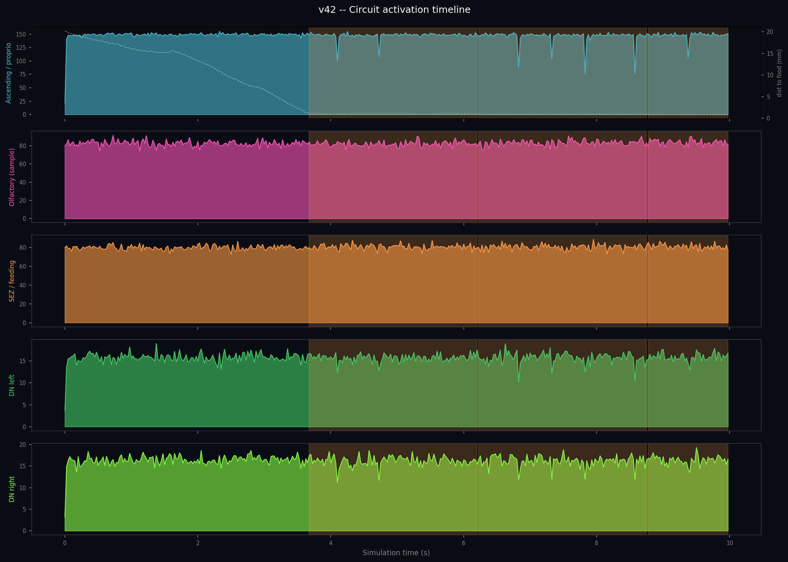

Mean firing rate (Hz) for each circuit over the full 10-second simulation. The white dashed line (right axis) shows distance to food. Orange shaded areas mark feeding episodes. Shows how circuits activate sequentially: ascending neurons continuously encode movement, olfactory neurons intensify as the fly approaches food, and SEZ activates on contact.

#### 02: Spike raster

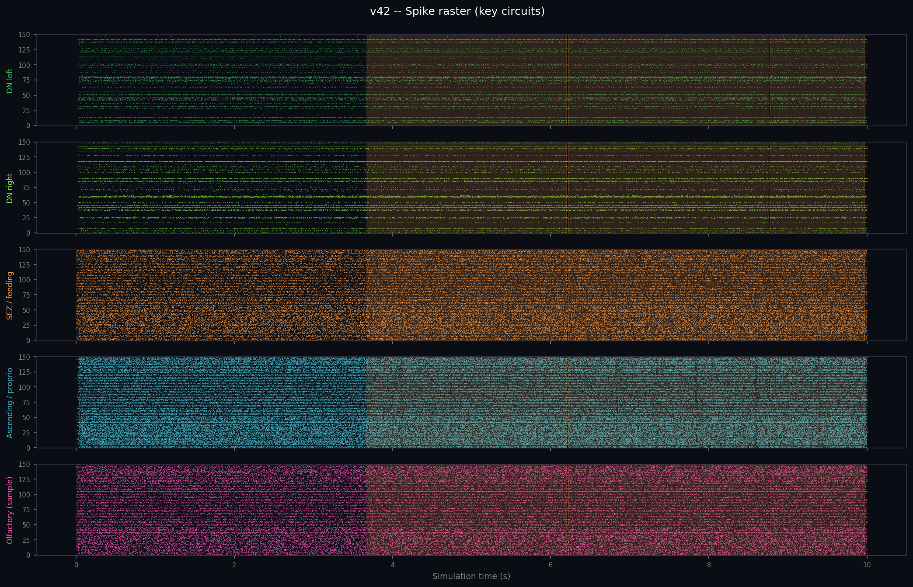

Each dot is a single spike (neuron × time). Capped at 150 neurons per circuit for readability. Reveals inter-neuron variability: some DN neurons fire heavily, others are silent; a characteristic pattern of a LIF network with heterogeneous connectivity.

#### 03: Descending neurons vs motor output

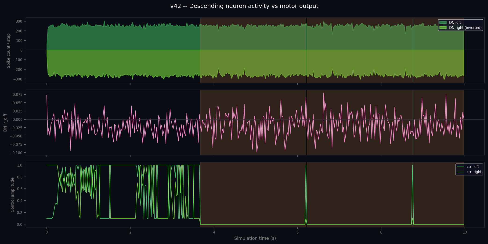

Three stacked panels: DN left/right spike counts, left-right asymmetry (lr_diff), and motor control amplitudes. Directly visualizes the brain→body link: a DN asymmetry translates into a differential control command that steers the fly.

#### 04: Closed-loop coupling

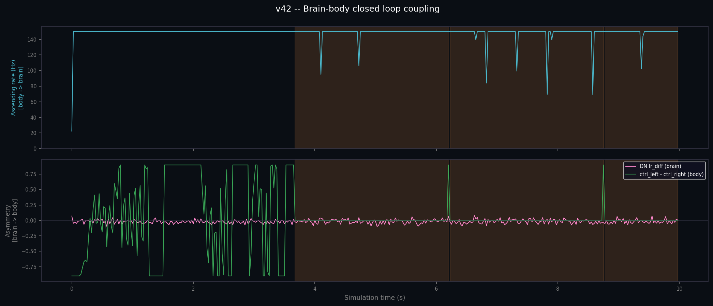

Both directions of the closed loop in a single figure. Top panel: ascending rate modulated by leg kinematics (body→brain). Bottom panel: DN asymmetry overlaid with motor control differential (brain→body). Validates that both feedback pathways are active simultaneously.

#### 05: Population firing rate heatmap

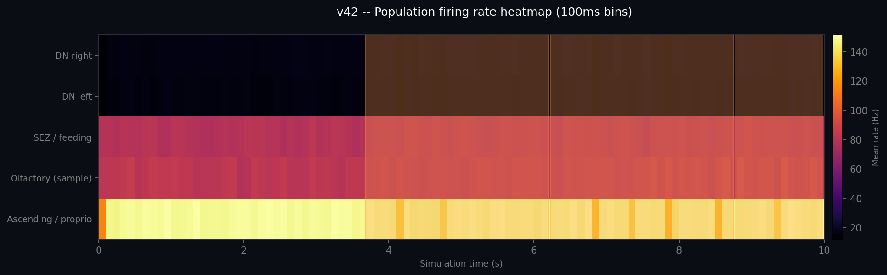

Spike density binned at 100 ms per circuit, shown as a 2D grid (circuit × time). The inferno colormap highlights periods of intense activity. Gives a synthetic view of the whole network's temporal dynamics at a glance.

#### 06: Firing rate distribution

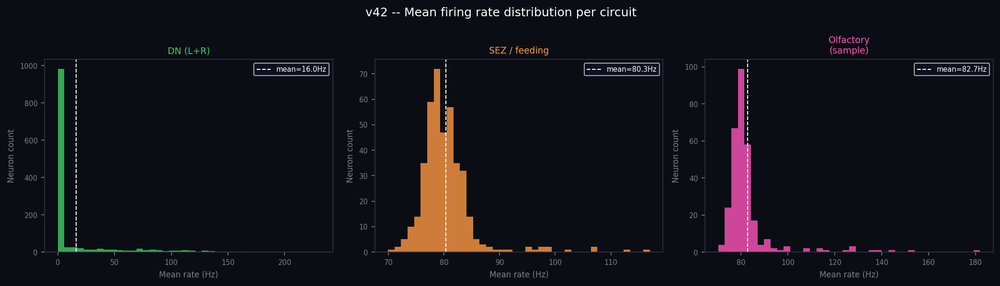

Histogram of mean firing rate over 10 s per neuron in the DN, SEZ and olfactory circuits. Reveals the heterogeneous distribution characteristic of a realistic LIF network: most neurons fire rarely, with a tail of highly active ones.

#### 07: Odor gradient vs olfactory circuit

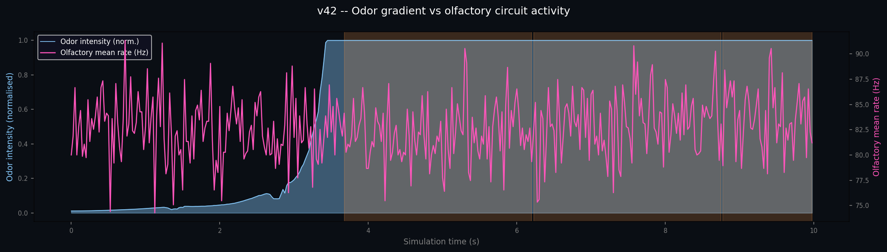

Odor intensity measured by the physical sensors (blue) overlaid with the mean rate of the Brian2 olfactory circuit (pink). Validates that the physical sensory signal propagates through to neural activity; the olfactory layer genuinely lights up as the fly approaches the food source.

#### 08: Compound-eye luminance vs lamina firing rate

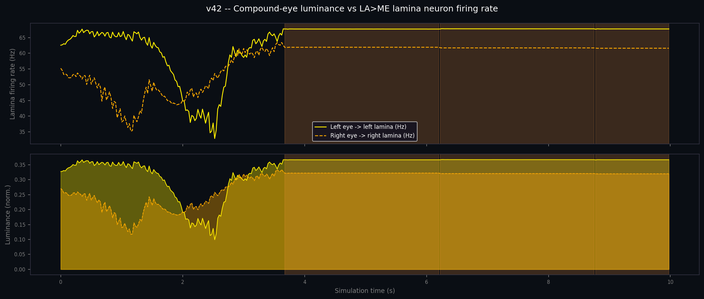

Two-panel figure. Top: left and right lamina firing rates (Hz) driven by compound-eye luminance over time. Bottom: normalized luminance per eye. Shows how the visual signal varies as the fly approaches and passes the walls, providing the raw signal that feeds the flyvis T5 network.

#### 09: XY trajectory with wall layout

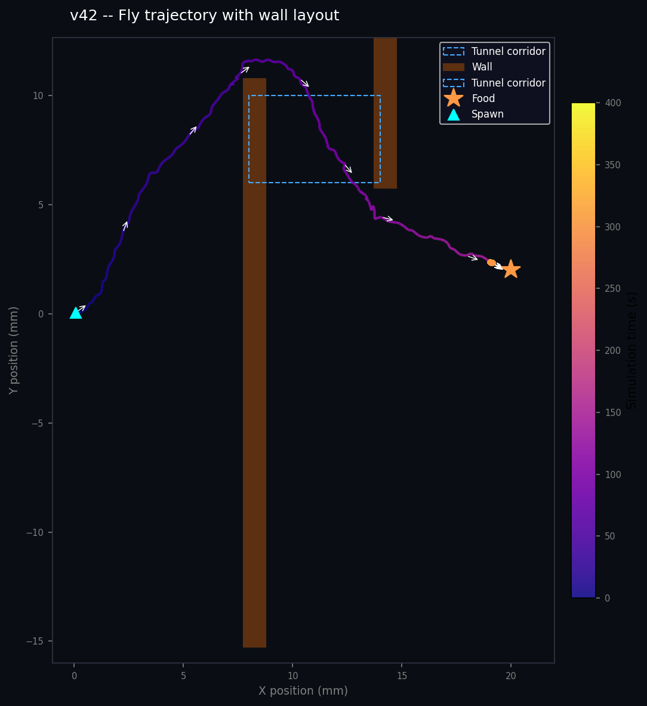

XY trajectory colored by time (plasma colormap), heading arrows every 20 steps, food star marker, spawn triangle. Walls rendered from the `odor_field/blocked` grid, tunnel corridor outlined with a dashed blue rectangle. Axes auto-scaled to the actual trajectory extent. Replaces the old cylinder-landmark version.

#### 10: flyvis T5 looming reflex and steering bias

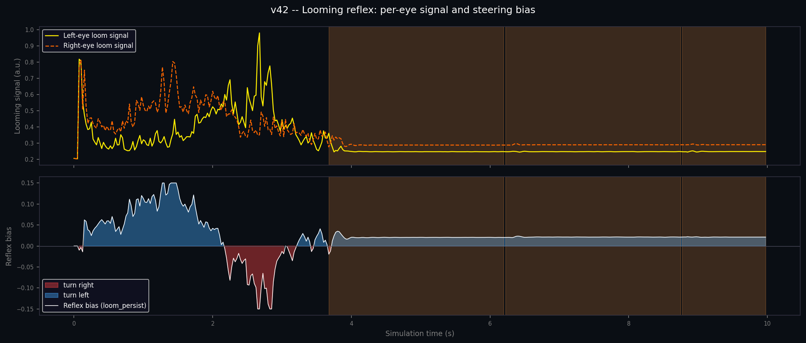

Two-panel figure. Top: T5 activity per eye over time (abs mean of T5a+T5b). Bottom: loom_bias fill (red = turn right, blue = turn left) showing how the reflex accumulates and decays as the fly navigates the walls.

#### 11: Left vs right antenna odor and steering

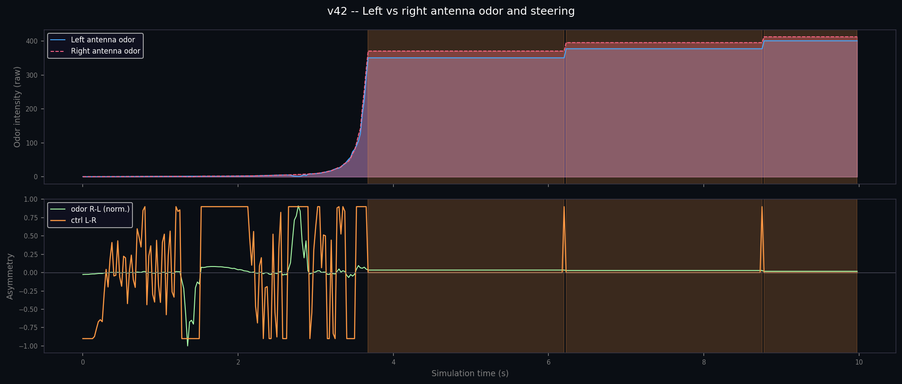

Two-panel figure. Top: raw channeled odor intensity at left and right antennae over time (path-distance field, not straight-line diffusion). Bottom: normalized odor R-L asymmetry vs motor turn signal, overlaid.

#### 12: Trajectory overlaid on Dijkstra odor heatmap

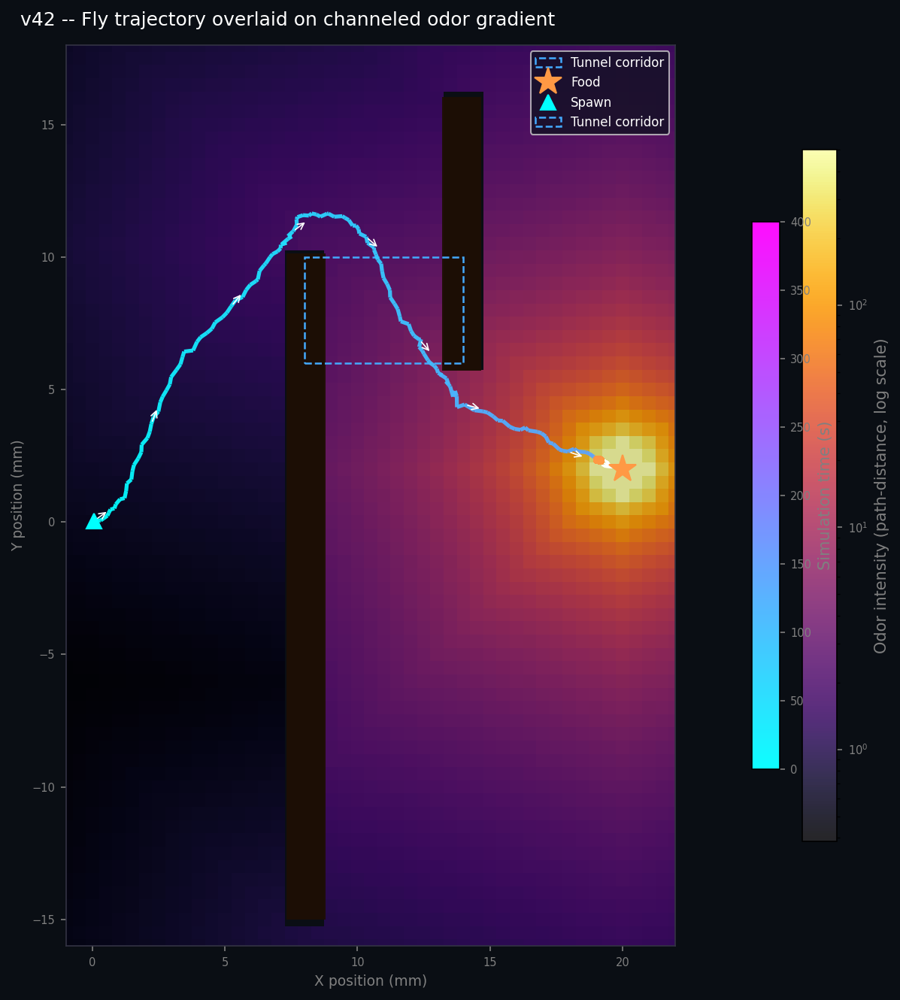

The fly's full XY path overlaid on the pre-computed Dijkstra odor gradient (inferno colormap, log scale). Walls shown as a dark overlay from the blocked grid. Path in cool colormap (early = blue, late = cyan), heading arrows every 20 steps. The most direct visual confirmation that the channeled gradient routes through the physical corridor gaps rather than through the walls.

#### 13: Odor-movement correlation

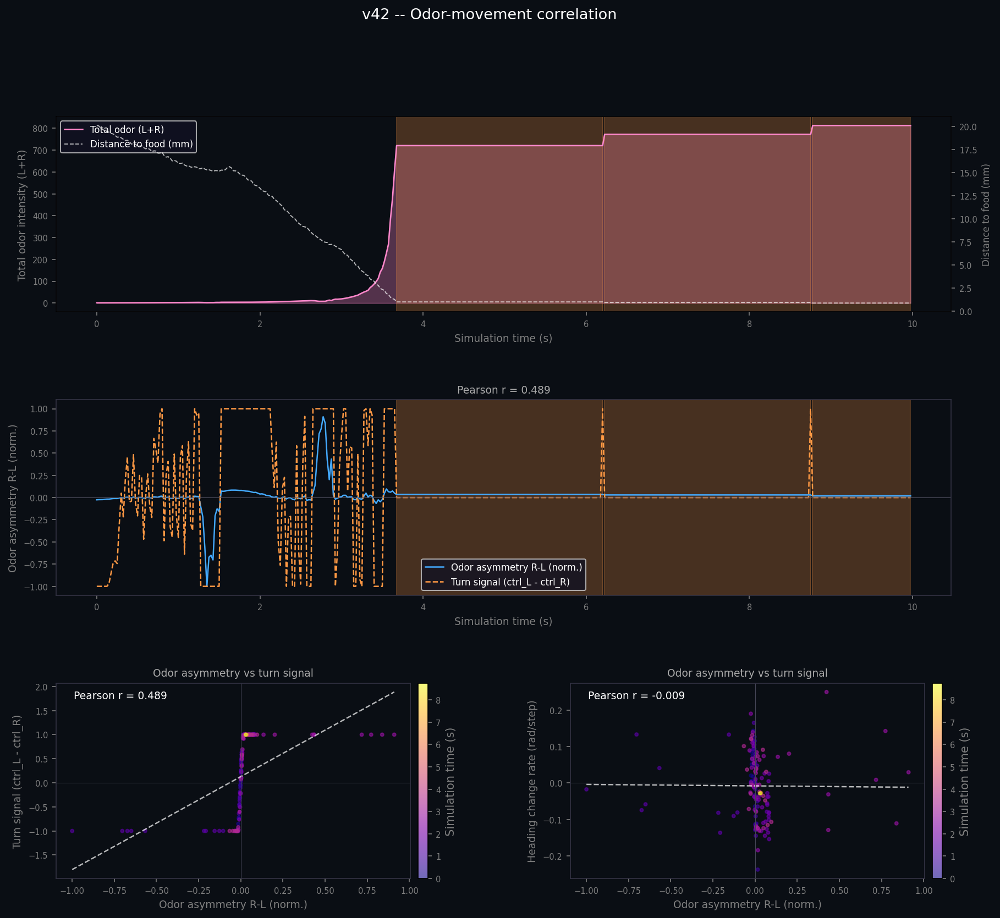

Four-panel figure showing the causal link between what the fly smells and how it moves. Top: total odor intensity and distance to food over time - shows the fly entering and leaving high-odor zones as it navigates the corridor. Middle: signed odor asymmetry (blue) vs normalized turn signal (orange) overlaid, Pearson r in title. Bottom-left scatter: odor asymmetry vs turn signal per step colored by time, with regression line - a tight cluster means odor directly drives turning. Bottom-right scatter: odor asymmetry vs heading change rate - tests whether the antenna gradient predicts actual rotation before the CPG translates it to leg motion. All scatter plots exclude feeding steps.

---

## Installation

### System requirements

- Windows 10 / 11 (64-bit)
- **Python 3.10**: required exactly (flygym and Brian2 validated on 3.10)
  Download: [python.org/downloads](https://www.python.org/downloads/release/python-31011/)
- **ffmpeg**: required for video encoding
  Download: [ffmpeg.org/download.html](https://ffmpeg.org/download.html) → add to PATH

### Create the virtual environment

Open a command prompt in the project folder:

```bat
REM Create the venv with Python 3.10 specifically
py -3.10 -m venv wenv310

REM Activate the venv
wenv310\Scripts\activate

REM Upgrade pip
python -m pip install --upgrade pip
```

### Install dependencies

```bat
pip install -r requirements.txt
```

> **Note**: `flybody` installs from GitHub; git must be installed and available in PATH.
> Download git: [git-scm.com](https://git-scm.com/download/win)

### Configure the C++ backend for Brian2 (optional but strongly recommended: ×10 faster)

Without a compiler, the simulation still runs via the numpy backend; `run.bat` switches automatically. With the C++ compiler, the Brian2 run goes from ~50 min to ~5 min.

#### Step 1: Install Visual Studio 2022

Download **Visual Studio 2022 Community** (free):
[visualstudio.microsoft.com/downloads](https://visualstudio.microsoft.com/downloads/)

During installation, check the workload:
**"Desktop development with C++"**

> The **Build Tools** alone are sufficient if you don't want the full IDE:
> [Download Build Tools](https://visualstudio.microsoft.com/visual-cpp-build-tools/)

#### Step 2: Test the compiler

Open a **new** command prompt (not PowerShell) and type:

```bat
call "C:\Program Files\Microsoft Visual Studio\2022\Community\VC\Auxiliary\Build\vcvarsall.bat" x64
cl.exe
```

Expected output (success):

```text
Microsoft (R) C/C++ Optimizing Compiler Version 19.xx...
```

If you get `'cl' is not recognized`: vcvarsall.bat was not called, or the C++ component is not installed.

#### Step 3: Test Brian2 with the C++ backend

```bat
wenv310\Scripts\activate
call "C:\Program Files\Microsoft Visual Studio\2022\Community\VC\Auxiliary\Build\vcvarsall.bat" x64
python -c "from brian2 import *; G = NeuronGroup(1, 'dv/dt = -v/ms : 1'); net = Network(G); net.run(1*ms); print('SUCCESS C++ BACKEND')"
```

If Brian2 compiles with Cython (first run ~30 s) and prints `SUCCESS C++ BACKEND`, the compiler is operational. `run.bat` will detect it automatically on every launch.

---

## Running

### Option A: Docker (any OS, no local setup required)

If you don't have Docker, install Docker Desktop first: [docs.docker.com/get-started/get-docker](https://docs.docker.com/get-started/get-docker/)

```bash
# Build the image (one time, ~5–10 min)
docker build -t fly-brain-sim .

# Run: outputs are written to your local simulations/, logs/, plots/
docker run --rm \
  -v $(pwd)/simulations:/app/simulations \
  -v $(pwd)/logs:/app/logs \
  -v $(pwd)/plots:/app/plots \
  fly-brain-sim
```

On Windows PowerShell replace `$(pwd)` with `${PWD}`. Brian2 uses GCC inside the container: no Visual Studio needed. First run adds ~13 min for Cython compilation; to persist the cache across runs add `-v brian2-cache:/root/.cython` to the command.

### Option B: Windows native (recommended for development)

**Recommended: use the launch script** (automatically configures the C++ compiler):

```bat
run.bat
```

Or manually from a command prompt with the VS environment:

```bat
call "C:\Program Files\Microsoft Visual Studio\2022\Community\VC\Auxiliary\Build\vcvarsall.bat" x64
wenv310\Scripts\python.exe fly_brain_body_simulation.py
```

**Estimated duration: ~2.5–3 hours** with the C++ backend (warm cache). The very first run adds ~13 min for C++ compilation (Brian2 compiles ~50M synapses via Cython/C++ once, then caches).

Measured per-step cost (reference machine, 138k neurons, 50M synapses):

| Step | Time per step | Total (400 steps) |
| --- | --- | --- |
| `net.run(25ms)` Brian2 | ~20–30 s | ~130–180 min |
| MuJoCo physics + render | ~0.5 s | ~3 min |
| Glow compute + brain render | (after loop) | ~10 min |
| Video write | (after loop) | ~2 min |
| **TOTAL** | | **~2.5–3 h** |

Live progress log is written to `logs/YYYY-MM-DD_HH-MM-SS_run.log` (stdout + stderr):

```text
  step 000/400  t=0.00s  [walk]  proprio=0ms  brian=24557ms  physics=9320ms  step_total=33879ms  asc=22Hz  DN L51/R49 lr=+0.02  dist=21.6mm  ETA=225.3min
  step 010/400  t=0.25s  [walk]  proprio=0ms  brian=17696ms  physics=446ms   step_total=18142ms  asc=150Hz  DN L254/R248 lr=+0.01  dist=21.1mm  ETA=150.0min
  FEEDING START  t=2.30s  dist=1.18mm
  step 090/400  t=2.25s  [walk]  proprio=0ms  brian=21197ms  physics=521ms   step_total=21722ms  asc=150Hz  DN L264/R267 lr=-0.01  dist=1.6mm   ETA=122.0min
```

To fall back to the numpy backend (no compiler needed), uncomment in `fly_brain_body_simulation.py`:

```python
# from brian2 import prefs; prefs.codegen.target = "numpy"
```

> **Windows note**: `flygym` / `dm_control` must be imported **before** `load_dotenv()`. The `.env` sets `MUJOCO_GL=egl` (Linux GPU renderer). If loaded first on Windows, the import fails. The import order in the script is intentional.

---

## Architecture and pipeline

```text
[FlyWire v783 connectome data]
        │
        ▼
[1. Load 138,639-neuron index + annotations]
   Completeness_783.csv → Brian2 index
   flywire_annotations.tsv → cell types, soma positions
        │
        ▼
[2. Extract neuron groups]
   Before any soma coordinate filtering:
   - ascending (1,736)    → dynamic Poisson stimulation (proprioceptive feedback)
   - olfactory ORN/PN (2,279) → pink layer, alpha ∝ odor intensity
   - SEZ/feeding (408)    → orange layer, alpha ∝ feeding state
   - DNs (1,299)          → green layer + motor readout
        │
        ▼
[3. Build Brian2 LIF network]
   138,639 LIF neurons, ~50M synapses, C++ backend (default)
   PoissonGroup for ascending neurons (rates updated each step)
   olfactory + SEZ stimulated @ 80 Hz (fixed Poisson)
        │
        ▼
[4. Build flygym simulation]
   OdorArena (food at [20,2,0] mm, peak_odor_intensity=1.0 dummy)
   Dijkstra odor field pre-computed on 0.5mm/cell grid (walls block paths)
   Two solid walls: wall1 at x=8 spanning y=-15..10, wall2 at x=14 spanning y=6..16
   Fly spawned at (0,0,0.2) heading northeast (0.588 rad, ~34 deg)
   Three cameras: isometric + top-down + back cat cam
   Mocap proboscis probe (blue capsule)
        │
        ▼
[5. Interleaved brain+physics loop: 400 × 25 ms decisions]
   Each step:
     obs["joints"] → joint velocity → ascending neuron rate (22–150 Hz)
     net.run(25ms) → DN spike readout → lr_diff_t
     Dijkstra odor at antenna positions + DN bias → motor command [left_amp, right_amp]
     flyvis T5 → loom_bias (GAIN=0.5, BIAS_MAX=0.15) → turn assist
     250 MuJoCo microsteps (3 camera renders)
     dist < 1.2 mm → feeding (probe extend→eat→retract)
     [NAV] milestone prints + [ODR] status every 20 steps
        │
        ▼
[6. Compute brain glow frames from accumulated spike trains]
   ~300 frames @ 30 fps, exponential decay τ=80 ms
        │
        ▼
[7. Render brain panels: 1,200 frames]
   5 color-coded scatter layers stacked per frame:
     navy background → LIF activity → green DN → pink olfactory → orange SEZ
        │
        ▼
[8. Write split-screen video]
   Row 1: brain panel (1280×480)
   Row 2: iso view + top-down view (640×H each)
   Row 3: cat cam back view (1280×H, full width)
   h264, CRF 18, yuv420p
        │
        ▼
[9. Export simulation data: simulations/vN_data.h5]
   HDF5 format (h5py, gzip):
     /behavior  → behavioral timeseries (400 steps × 25 ms)
     /spikes    → spike trains per circuit (DN, SEZ, olfactory, ascending)
     /positions → soma coordinates per circuit
     /meta      → simulation parameters and metadata
   Consumed by generate_plots.py → plots/vN/EN/ + plots/vN/FR/
```

---

## The brain model: Brian2 LIF

### Data source

The FlyWire v783 connectome contains the complete map of every neuron and synapse in the adult *Drosophila melanogaster* brain, assembled by transmission electron microscopy (TEM) by the FlyWire project (Princeton, Janelia, UCL). Version 783 = 138,639 neurons, ~50 million synapses.

### Leaky Integrate-and-Fire neuron model

Each neuron is modeled by two differential equations:

```text
dv/dt = (v_0 - v + g) / t_mbr   [membrane dynamics: "leak" toward rest]
dg/dt = -g / tau                  [synaptic conductance decay]
```

When `v` exceeds `v_th`, the neuron fires a spike and resets to `v_rst` for a refractory period `t_rfc`.

### LIF parameters

| Parameter | Value | Biological meaning |
| --- | --- | --- |
| `v_0` | -52 mV | Resting potential |
| `v_th` | -45 mV | Firing threshold (+7 mV above rest) |
| `v_rst` | -52 mV | Post-spike reset |
| `t_mbr` | 20 ms | Membrane time constant |
| `tau` | 5 ms | Synaptic conductance decay |
| `t_rfc` | 2.2 ms | Refractory period |
| `t_dly` | 1.8 ms | Synaptic transmission delay |
| `w_syn` | 0.275 mV | Weight per synapse |
| `r_poi` | 150 Hz | Max Poisson stimulation rate (ascending neurons) |
| `r_poi2` | 80 Hz | Stimulation rate for olfactory (ORN/PN) and SEZ neurons |

### Choice of stimulated neurons

**Ascending neurons** are chosen as input because they constitute the primary proprioceptive channel: they carry the "legs are moving" signal from body to brain. Connectivity analysis shows they make 646 direct synapses onto locomotion DNs, reaching 28 distinct DNs; far more than any other sensory type.

Their firing rate is **dynamic**: at each 25 ms window, leg angular velocity is computed from `obs["joints"]` and encoded as a Poisson rate between `PROPRIO_MIN × 150 Hz` (immobility) and `150 Hz` (fast walking). The brain receives a signal that reflects the fly's actual locomotor state at every moment.

### C++ backend (default)

Brian2 automatically compiles LIF equations to C++ via Cython: **10× faster** than pure-Python numpy. On Windows, this requires Visual Studio 2022 with "Desktop development with C++" and the MSVC environment initialized (`vcvarsall.bat x64`) before launching Python. `run.bat` handles this automatically.

To force numpy backend:

```python
from brian2 import prefs; prefs.codegen.target = "numpy"
```

This line must be placed **before any Brian2 object creation**.

### Soma positions for visualization

- Axes: `soma_x` (left-right) vs inverted `soma_y` (dorsal-ventral)
- `soma_z` is the depth axis at 40 nm/vox: too flat for a vertical axis
- Neurons without `soma_x/y` (olfactory, SEZ) use `pos_x/y` as fallback: 100% coverage

---

## The body model: NeuroMechFly

### MuJoCo model specifications

| Property | Value |
| --- | --- |
| Total degrees of freedom | 87 joints |
| Joints per leg | 7 (Coxa, Coxa_roll, Coxa_yaw, Femur, Femur_roll, Tibia, Tarsus1) |
| Leg joints | 42 (6 legs × 7 DOF) |
| Olfactory sensors | 4 (left/right antenna + left/right palp) |
| Adhesive pads | Enabled |
| Physics timestep | 0.1 ms (1e-4 s) |
| Gravity | -9810 mm/s² |

### HybridTurningController

Receives a 2D signal at each 25 ms step:

```python
obs, reward, terminated, truncated, info = sim.step([left_amp, right_amp])
# left_amp, right_amp ∈ [0, 1]
```

Internally: sets CPGNetwork amplitudes (6 coupled oscillators) → tripod gait (Tripod A: LF, RM, RH / Tripod B: RF, LM, LH in antiphase) → stumbling/retraction rules → `physics.step()`.

**Turning**: reducing amplitude on one side slows that tripod → fly curves toward that side.

### Olfactory sensors

`obs["odor_intensity"]` → shape `(1, 4)` → `[left_ant, right_ant, left_palp, right_palp]`

Inverse-square diffusion: `C(r) = peak_intensity / r²`. With `peak_intensity = 500`: ~2 at 15 mm, ~100 at 7 mm, ~1,500 below 2 mm.

---

## Brain-body interface

### DN motor readout

At each 25 ms Brian2 step, DN spikes are read from the spike monitor:

```python
new_i       = np.asarray(spk_mon.i)[prev_n:]
left_count  = np.isin(new_i, dn_left_ids).sum()
right_count = np.isin(new_i, dn_right_ids).sum()
lr_diff_t   = (left_count - right_count) / (left_count + right_count + ε)
```

### Control signal

```python
# Olfactory guidance (primary signal)
lr_asym   = (right_odor - left_odor) / (total_odor + ε)
odor_turn = np.tanh(lr_asym * 20.0) * ODOR_TURN_K   # ODOR_TURN_K = 2.5

# Brain modulation (biological variation)
dn_bias = lr_diff_t * 0.15

turn_bias = odor_turn + dn_bias
left_amp  = clip(WALK_AMP + turn_bias, 0.1, 1.0)
right_amp = clip(WALK_AMP - turn_bias, 0.1, 1.0)
```

`np.tanh` amplifies small odor asymmetries at long range into a decisive turn. The `×0.15` factor ensures the brain modulates without overriding the olfactory signal.

---

## Brain visualization

### Exponential decay glow

```python
glow *= exp(-FRAME_DT_MS / DECAY_TAU_MS)   # decay τ=80 ms
glow[spiked_neurons] += 1.0                 # spike → instant boost
```

### Five layers per frame

| Layer | Neurons | Color | Behavior |
| --- | --- | --- | --- |
| Background | 138,617 | Navy `#1a3a5c` | Static, anatomy always visible |
| LIF | 138,617 | Cyan → white | Glow ∝ individual spike activity |
| DN | 1,299 | Bright green | Fixed alpha 0.75, vmax=0.25 |
| Olfactory | 2,279 | Pink/magenta | Stimulated @ 80 Hz in Brian2; alpha ∝ odor intensity |
| SEZ | 408 | Orange | Stimulated @ 80 Hz in Brian2; alpha ∝ feeding phase |

---

## Navigation and feeding behavior

### Zigzag route through the tunnel

The fly navigates a physical two-wall corridor before reaching food. The walls are solid MuJoCo geoms with soft contact parameters (solimp/solref) to prevent physics instability from adhesion-surface interaction. The odor field is pre-computed as a Dijkstra shortest-walkable-path grid, so the gradient routes through the gap openings rather than penetrating walls.

**Navigation milestones** (printed once each):

1. Walk northeast from spawn, approach wall 1 at x=8mm
2. Find gap at y>=10 (north of wall 1) and cross
3. Enter tunnel corridor (x=8..14, y=6..10)
4. Find gap at y<=6 (south of wall 2) and cross at x=14mm
5. Continue south-southeast to food at (20, 2, 0)

**flyvis T5 contribution**: the connectome-constrained T5 motion detector fires asymmetrically when wall surface fills more of one eye than the other. With GAIN=0.5 and BIAS_MAX=0.15, it provides a gentle push toward the gap without oversteering. With walls + channeled odor, B (walls + flyvis T5) and C (walls, odor only) both reach food around step 145 vs step 156 for A (no walls).

### Typical timeline

| Physical time | Behavior | Active neurons |
| --- | --- | --- |
| 0–1.5 s | Walking northeast toward wall 1 | DN (green) |
| ~1.5 s | Crosses gap at y>=10 into tunnel | DN + olfactory (pink) |
| ~2–3 s | Traverses tunnel, finds gap at y<=6 | DN + olfactory (pink) |
| ~3–3.5 s | Past wall 2, heading to food (20, 2) | DN + olfactory (pink) |
| ~3.5 s | Dist < 1.2 mm → feeding | DN + olfactory + SEZ (orange) |
| ~3.5–4 s | Proboscis extends | SEZ (orange) |
| ~4–6 s | Active feeding | SEZ (orange) |
| ~6–6.5 s | Proboscis retracts | SEZ (orange) |
| ~6.5 s | Resumes walking | DN (green) |

### Proboscis (blue probe)

MuJoCo mocap body (blue capsule) positioned between `0/Haustellum` and the food. Orientation computed by quaternion rotation of Z-axis toward `food_pos - haustellum_pos`. Extension follows an S-curve via a normalized timer.

---

## Key parameters

All tunable constants are at the top of `fly_brain_body_simulation.py`:

| Parameter | Default | Effect |
| --- | --- | --- |
| `PHYS_DURATION_S` | 10.0 s | Physical + brain duration (identical) |
| `PLAY_SPEED` | 0.25 | 4x slow motion (10 s physics = 40 s video) |
| `STIM_RATE_HZ` | 150 Hz | Max Poisson rate for ascending neurons |
| `FOOD_POS` | [20, 2, 0] mm | Food position (south of wall 2 gap) |
| `GRID_RES` | 0.5 mm | Dijkstra odor grid cell size |
| `ANT_SEP` | 0.5 mm | Lateral antenna separation for odor sampling |
| `FEED_DIST` | 1.2 mm | Distance threshold to trigger feeding |
| `FEED_DUR` | 2.0 s | Active feeding phase duration |
| `ODOR_TURN_K` | 2.5 | Olfactory turn strength |
| `WALK_AMP` | 0.75 | Base walking amplitude [0-1] |
| `DECAY_TAU_MS` | 80 ms | Brain glow decay time constant |
| `DECISION_INTERVAL` | 0.025 s | Control window duration (25 ms) |
| `PROPRIO_MIN` | 0.15 | Min ascending rate fraction during stillness |
| `MAX_JOINT_VELOCITY` | 8.0 rad/s | Reference velocity for proprioceptive encoding |
| `FLYVIS_T5_GAIN` | 0.5 | flyvis T5 reflex gain (gentle - prevents oversteer) |
| `FLYVIS_DECAY` | 0.5 | Exponential decay of T5 bias per step |
| `FLYVIS_BIAS_MAX` | 0.15 | Clamp on T5 turn bias (assists odor without dominating) |

---

## Repository structure

```text
fly_brain_simulation/
├── fly_brain_body_simulation.py   # complete pipeline, single entry point
├── generate_plots.py              # analysis plots from HDF5 data
├── run.bat                        # launch script (auto-detects C++ compiler)
├── requirements.txt               # Python dependencies
├── brain_model/
│   ├── model.py                   # Brian2 LIF network builder (create_model, poi)
│   ├── Completeness_783.csv       # 138,639-neuron index (FlyWire v783)
│   ├── Connectivity_783.parquet   # synapse table (~50M rows)
│   ├── flywire_annotations.tsv    # cell types + soma/pos coordinates
│   └── descending_neurons.csv     # 1,299 DNs with lateral side labels
├── simulations/
│   ├── preview.gif                # v1 README preview
│   ├── preview2.gif               # v4 README preview
│   └── vN_brain_body_v4.mp4       # versioned output videos
├── tests/
│   ├── test_flyvis_stateful_timing.py   # 174x speedup of stateful forward() confirmed
│   ├── test_fly_body_height.py          # CoM z=−0.36mm: wall base must be <−0.4mm
│   ├── test_wall_heading0588.py         # zigzag corridor, all 3 conditions reach food
│   ├── test_solid_wall_stability.py     # BADQACC fixes for solid geoms
│   ├── test_vision_sensor.py            # obs["vision"] response characterization
│   └── test_looming_integration.py      # off-path cylinders: +18 step detour confirmed
├── .env                           # MUJOCO_GL=egl (GPU renderer)
├── CLAUDE.md                      # Claude Code instructions
├── README.md                      # French documentation
└── README.en.md                   # English documentation (this file)
```

---

## Dependencies

All pre-installed in `wenv310/` (Python 3.10, Windows):

| Package | Version | Role |
| --- | --- | --- |
| `brian2` | 2.9.0 | LIF network simulation |
| `Cython` | 3.2.4 | Brian2 C++ backend compilation |
| `flygym` | 1.2.1 | NeuroMechFly + MuJoCo |
| `flybody` | git | MuJoCo fly XML model |
| `dm_control` | 1.0.27 | DeepMind MuJoCo bindings |
| `mujoco` | 3.2.7 | Physics engine |
| `numpy` | 2.0.2 | Matrix computation |
| `pandas` | 2.3.3 | Connectome loading |
| `scipy` | 1.15.3 | Quaternions (proboscis orientation) |
| `matplotlib` | 3.10.8 | Brain panel rendering |
| `imageio` | 2.37.3 | Video encoding |
| `pyarrow` | 23.0.1 | Parquet support for connectome data |
| `python-dotenv` | 1.2.2 | `.env` config |

---

## Scientific basis

**Brain model**: based on [philshiu/Drosophila_brain_model](https://github.com/philshiu/Drosophila_brain_model):
> Shiu et al. (2023). *A leaky integrate-and-fire computational model based on the connectome of the entire adult Drosophila brain.* PLOS Computational Biology.
> DOI: [10.1371/journal.pcbi.1011280](https://doi.org/10.1371/journal.pcbi.1011280)

**FlyWire v783 connectome**: [flywire.ai](https://flywire.ai):
> Dorkenwald et al. (2024). *Neuronal wiring diagram of an adult brain.* Nature.
> DOI: [10.1038/s41586-024-07558-y](https://doi.org/10.1038/s41586-024-07558-y)
>
> Schlegel et al. (2024). *Whole-brain annotation and multi-connectome cell typing.* Nature.
> DOI: [10.1038/s41586-024-07686-5](https://doi.org/10.1038/s41586-024-07686-5)

**NeuroMechFly v2**: [neuromechfly.org](https://neuromechfly.org) | [flygym/flygym](https://github.com/NeuromechFly/flygym):
> Lobato-Rios et al. (2023). *NeuroMechFly 2.0, a framework for simulating embodied sensorimotor control in adult Drosophila.* Nature Methods.
> DOI: [10.1038/s41592-024-02497-y](https://doi.org/10.1038/s41592-024-02497-y)

**MuJoCo**: [mujoco.org](https://mujoco.org) | [google-deepmind/mujoco](https://github.com/google-deepmind/mujoco):
> Todorov et al. (2012). *MuJoCo: A physics engine for model-based control.* IROS.
> DOI: [10.1109/IROS.2012.6386109](https://doi.org/10.1109/IROS.2012.6386109)

**Brian2**: [brian2.readthedocs.io](https://brian2.readthedocs.io) | [brian-team/brian2](https://github.com/brian-team/brian2):
> Stimberg et al. (2019). *Brian 2, an intuitive and efficient neural simulator.* eLife.
> DOI: [10.7554/eLife.47314](https://doi.org/10.7554/eLife.47314)

---

## Limitations and future work

### 1. VNC not modeled: open research problem

The VNC (*Ventral Nerve Cord*) connectome has been partially mapped. The problem is **integration**: the VNC contains ~70,000 additional neurons including CPGs that produce individual commands for each leg joint. Correctly connecting these to the 87 DOF of the MuJoCo model (respecting neuronal topography and motor types) is an open research problem. We work around it with flygym's CPGNetwork.

**Next step**: integrate the Janelia VNC connectome (*FANC*, 2023) and map annotated motor neurons to their corresponding MuJoCo DOFs.

### 2. Proprioceptive feedback: ✅ implemented

**What we had**: ascending neurons received uniform constant Poisson noise at 150 Hz for the entire 10 s Brian2 run. The brain "heard" the same signal regardless of what the fly was doing. Brian2 and physics ran as two sequential pipelines with no exchange.

**What we changed**:

1. **Interleaved architecture**: instead of a single `net.run(10,000 ms)`, the physics loop now calls `net.run(25 ms)` at each decision. Brian2 and MuJoCo advance in synchrony.

2. **`PoissonInput` → `PoissonGroup`**: `PoissonInput` has a rate fixed at creation. We switched to `PoissonGroup`, whose `rates` attribute can be updated between each 25 ms step.

3. **Velocity → rate encoding**: at each decision:

   ```text
   r = SENSORY_STIM_RATE × (PROPRIO_MIN + (1 − PROPRIO_MIN) × clamp(velocity / max, 0, 1))
   ```

   between `22 Hz` (full immobility) and `150 Hz` (fast walking).

**Observed effect**: during feeding, legs stop moving → ascending rate drops to ~22 Hz → the brain receives a different signal than during walking. DN output is now **causal**.

### 3. Mouth joints removed: flygym model limitation

The MuJoCo model includes proboscis geometry (`0/Haustellum`, `0/Rostrum`, `0/Labrum`) but without joints or actuators. Current approach: mocap body manually positioned via `physics.data.mocap_pos`, no physics, but visually convincing.

### 4. Contextual brain stimulation: ✅ resolved by proprioceptive feedback

With the proprioceptive loop, behavioral modulation now emerges from neural dynamics rather than being applied as a hard-coded rule. During feeding, the ascending rate drops naturally, producing different brain activity.

### 5. Performance: C++ backend enabled ✅

Visual Studio 2022 Community is installed. `run.bat` configures MSVC automatically. Brian2 run: **~5 min** (vs ~50 min with numpy). `run.bat` falls back to numpy automatically if no compiler is found.

---

## Positioning in the open-source ecosystem

To our knowledge, **no public open-source project combines all three layers** of this simulation (full connectome + body physics + closed sensory loop) for *Drosophila*.

| Layer | This project | Public state of the art |
| --- | --- | --- |
| LIF brain on real connectome | ✅ 138,639 neurons, 10 s continuous | ✅ philshiu (1 s, no body) |
| 3D MuJoCo physical body | ✅ NeuroMechFly, 87 DOF | ✅ flygym (no brain) |
| Olfactory navigation connected to brain | ✅ ORN/PN stimulated @ 80 Hz Brian2 | ❌ flygym (body only) |
| Feeding behavior (SEZ) | ✅ proboscis + SEZ stimulated @ 80 Hz | ❌ no public project |
| Real-time circuit visualization | ✅ 5 colored layers | ❌ no public project |
| Brian2 C++ backend | ✅ Visual Studio 2022, ~5 min/run | ✅ standard on Linux |
| Closed sensory loop (proprioception) | ✅ body → brain via joint velocity | ❌ no public project |

The loop is now fully closed: the brain influences the body (via DNs), and the body influences the brain (via ascending neuron proprioceptive feedback).

---

## Motivations and future directions

### Origin of the project

I am a software engineer living with Multiple Sclerosis. That combination (a personal stake in understanding demyelinating disease and the technical background to build computational tools) is the direct reason this project exists.

The initial question was straightforward: could publicly available open-source tools (a real connectome, a physics simulator, a spiking network framework) be assembled into a working closed-loop brain-body simulation, entirely on consumer hardware, without institutional resources? This project is the answer: a solo implementation built on a mid-range laptop, integrating FlyWire, Brian2, and NeuroMechFly into a single pipeline.

Three motivations drove it:

1. **Personal investment**: MS is the condition I wanted to understand computationally. The possibility of watching how circuit disruption propagates through a real connectome, in simulation, was the hook that started everything.
2. **Learning by building**: as a software engineer with no formal neuroscience background, this was a way to learn computational neuroscience by doing it: spiking networks, MuJoCo physics, C++ compilation backends, connectome data formats, all at once.
3. **Accessibility**: large-scale neural simulations are almost always run on compute clusters. A concrete goal of this project was to demonstrate that a biologically grounded, full-connectome, closed-loop simulation can run on an above-average personal computer (here: a ~2.5–3 hour run on a Windows laptop with a mid-range GPU and Visual Studio's C++ compiler). No supercomputer, no institutional account required.

---

### Why Multiple Sclerosis cannot be modelled in Drosophila

Despite the personal motivation, MS had to be ruled out as a simulation target after reviewing the biology.

**The biological mismatch is fundamental.** MS is a vertebrate-specific autoimmune demyelinating disease. It depends on myelin sheaths produced by oligodendrocytes, adaptive immunity (T-cells, B-cells), and blood-brain barrier disruption; none of which exist in *Drosophila*. Fruit flies have no myelin.

This is not a modelling limitation that could be worked around. It is a hard biological fact confirmed by peer-reviewed literature:

- Bhatt et al. (2007). *"The fruit fly does not synthesize myelin in its CNS."* EMBO Reports. [PMC2660653](https://pmc.ncbi.nlm.nih.gov/articles/PMC2660653/)
- Nave & Trapp (2008). *Axon-glial signaling and the glial support of axon function.* Annual Review of Neuroscience. [10.1146/annurev.neuro.31.060407.125533](https://doi.org/10.1146/annurev.neuro.31.060407.125533)
- Gould & Morrison (2008). *Evolutionary and medical perspectives on the myelin proteome.* Journal of Neuroscience Research. [10.1002/jnr.21647](https://doi.org/10.1002/jnr.21647)

Extensive literature searches ("FlyWire connectome MS", "Drosophila multiple sclerosis", "fly brain demyelination") returned zero relevant results. *Drosophila* is used for some neurodegenerative conditions (ALS, Alzheimer's, Parkinson's models) but not for MS. MS research uses vertebrate models, primarily rodent EAE (experimental autoimmune encephalomyelitis), or human MRI/computational disease-progression models.

---

### Next step: towards a mammalian brain simulation

The natural progression from this project is to apply the same closed-loop architecture to mammalian neural data. The most promising public dataset for this is **MICrONS** (Machine Intelligence from Cortical Networks), a joint project from the Allen Institute, Baylor College of Medicine, and Princeton University.

**What MICrONS provides:**
> *"A cubic millimeter of mouse visual cortex, reconstructed at nanometer resolution: ~100,000 neurons and ~1 billion synapses."*
> MICrONS Consortium (2021). *Functional connectomics spanning multiple areas of mouse visual cortex.* bioRxiv. [10.1101/2021.07.28.454025](https://doi.org/10.1101/2021.07.28.454025)

Data and tooling: [microns-explorer.org](https://www.microns-explorer.org) | [github.com/seung-lab/MICrONS](https://github.com/seung-lab/MICrONS)

**The fundamental challenge: morphological complexity:**

A mammalian neuron is not a scaled-up insect neuron. The differences are structural and quantitative:

| Property | *Drosophila* neuron (FlyWire) | Mouse cortical neuron (MICrONS) |
| --- | --- | --- |
| Dendritic tree | Simple, compact | Highly branched, 100s of µm |
| Synapses per neuron | ~370 avg | ~5,000–10,000 avg |
| Morphological reconstruction | ~1 MB/neuron | ~100–500 MB/neuron |
| Total connectome size | ~1 GB (FlyWire) | ~1.3 **petabytes** (raw MICrONS EM) |
| Compartment modelling needed | No (point neuron sufficient) | Yes (dendrites matter computationally) |

The MICrONS dataset is a petabyte-scale project precisely because each mammalian neuron's morphology (its dendritic arbor, spine density, axonal branching) must be reconstructed at nanometer resolution to map synapses accurately. A point-neuron LIF model (as used here) loses the computational properties that arise from dendritic integration in pyramidal cells.

**What a mammalian simulation would require beyond this project:**

1. **Compartmental neuron models** (e.g. multi-compartment Hodgkin-Huxley or simplified cable models) rather than single-point LIF
2. **A physical body**: no equivalent of NeuroMechFly exists yet for mouse; this is an open problem
3. **Selective subgraph simulation**: even a 1 mm³ patch at full resolution cannot run in real time on consumer hardware; subsampling or abstract population models would be needed
4. **Disease modelling becomes possible**: unlike *Drosophila*, a mouse cortical model can include myelin, glia, and immune-related circuit disruption, making conditions like MS, ALS, or epilepsy directly addressable

The goal remains the same as for this project: make it run on a personal computer. The path there is not waiting for a cluster; it is smart subsampling, efficient point-neuron approximations of dendritic computation, and selective subgraph extraction from public datasets like MICrONS, CAVE, and the Human Connectome Project. The data is already public. The challenge is making the simulation tractable at consumer scale.

---

## Attributions

This project would not be possible without the work of the following teams.

### FlyWire v783 connectome

- **FlyWire**: [flywire.ai](https://flywire.ai) | [GitHub](https://github.com/seung-lab/cloud-volume)
  > Dorkenwald et al. (2024). Nature. [10.1038/s41586-024-07558-y](https://doi.org/10.1038/s41586-024-07558-y)
  > Schlegel et al. (2024). Nature. [10.1038/s41586-024-07686-5](https://doi.org/10.1038/s41586-024-07686-5)

### LIF model on Drosophila connectome

- **philshiu/Drosophila_brain_model**: [github.com/philshiu/Drosophila_brain_model](https://github.com/philshiu/Drosophila_brain_model)
  `brain_model/model.py` is directly derived from this repository.
  > Shiu et al. (2023). PLOS Computational Biology. [10.1371/journal.pcbi.1011280](https://doi.org/10.1371/journal.pcbi.1011280)

### NeuroMechFly body simulation

- **flygym/flygym**: [github.com/NeuromechFly/flygym](https://github.com/NeuromechFly/flygym) | [neuromechfly.org](https://neuromechfly.org)
  > Lobato-Rios et al. (2023). Nature Methods. [10.1038/s41592-024-02497-y](https://doi.org/10.1038/s41592-024-02497-y)

- **TuragaLab/flybody**: [github.com/TuragaLab/flybody](https://github.com/TuragaLab/flybody)

### MuJoCo physics engine

- **google-deepmind/mujoco**: [github.com/google-deepmind/mujoco](https://github.com/google-deepmind/mujoco) | [mujoco.org](https://mujoco.org)
  > Todorov et al. (2012). IROS. [10.1109/IROS.2012.6386109](https://doi.org/10.1109/IROS.2012.6386109)

### Brian2 spiking neural network simulator

- **brian-team/brian2**: [github.com/brian-team/brian2](https://github.com/brian-team/brian2) | [brian2.readthedocs.io](https://brian2.readthedocs.io)
  > Stimberg et al. (2019). eLife. [10.7554/eLife.47314](https://doi.org/10.7554/eLife.47314)

### Conceptual reference

- **OpenWorm**: [openworm.org](https://openworm.org) | [github.com/openworm](https://github.com/openworm)
  First open-source complete brain-body simulation (*C. elegans*, 302 neurons).
