# NeuroFly - Simulation Cerveau-Corps de *Drosophila melanogaster*

Français 🇫🇷 | [English 🇬🇧](README.en.md)


*v1 - Navigation olfactive seule, sans système visuel*


*v4 - Navigation en zigzag avec odeur canalisée, T5 flyvis et caméra dorsale*

Une simulation en boucle fermée de *Drosophila melanogaster* (drosophile) qui couple un réseau de neurones à décharges biologiquement précis à un corps physique 3D. L'activité neuronale issue du vrai connectome de la mouche pilote la locomotion, la navigation olfactive et le comportement alimentaire, le tout visualisé dans une vidéo en écran divisé.

Le cerveau et le corps partagent une **chronologie continue unique** (pas de boucle, pas de répétition). Le cerveau tourne exactement aussi longtemps que la simulation physique (10 secondes réelles).

> **Note** : projet personnel réalisé par un développeur logiciel solo, sans formation en neuroscience. Les choix de modélisation s'appuient sur des articles publiés et des outils open source existants (FlyWire, Brian2, NeuroMechFly). Toute erreur d'interprétation biologique est la mienne.

---

## Table des matières

1. [Description](#description)
2. [Sortie vidéo](#sortie-vidéo)
3. [Données de simulation et visualisations](#données-de-simulation-et-visualisations)
4. [Installation](#installation)
5. [Exécution](#exécution)
6. [Architecture et pipeline](#architecture-et-pipeline)
7. [Le modèle cérébral : Brian2 LIF](#le-modèle-cérébral--brian2-lif)
8. [Le modèle corporel : NeuroMechFly](#le-modèle-corporel--neuromechfly)
9. [Interface cerveau-corps](#interface-cerveau-corps)
10. [Visualisation cérébrale](#visualisation-cérébrale)
11. [Comportement de navigation et d'alimentation](#comportement-de-navigation-et-dalimentation)
12. [Paramètres clés](#paramètres-clés)
13. [Structure du dépôt](#structure-du-dépôt)
14. [Dépendances](#dépendances)
15. [Base scientifique](#base-scientifique)
16. [Limitations et perspectives](#limitations-et-perspectives)
17. [Motivations et directions futures](#motivations-et-directions-futures)

---

## Description

Ce projet simule trois niveaux biologiques simultanément et les fait interagir en temps réel :

**1. Cerveau : réseau LIF sur connectome réel**
138 639 neurones de type Leaky Integrate-and-Fire (LIF) sont instanciés à partir du connectome FlyWire v783. Les connexions synaptiques (~50 millions) proviennent directement des données de microscopie électronique. Les neurones ascendants (1 736 neurones, signal proprioceptif simulé) sont stimulés à 150 Hz via un processus de Poisson, propageant l'activité à travers tout le graphe synaptique pendant 10 secondes continues.

**2. Corps : simulation physique MuJoCo**
Un modèle 3D fidèle de *Drosophila* avec 87 degrés de liberté, 6 pattes, coussinets adhésifs, 4 capteurs olfactifs (antennes + palpes maxillaires), et un corps mocap pour le proboscis. La mouche navigue vers une source de nourriture, s'arrête pour se nourrir, puis reprend sa marche.

**3. Boucle fermée complète**
Les neurones descendants (DN) du cerveau fournissent un biais gauche/droite qui module le virage de la mouche. En retour, la cinématique des pattes issues de la simulation physique est encodée à chaque pas de 25 ms en taux de décharge des neurones ascendants : le cerveau "entend" réellement si la mouche marche ou s'arrête. Le signal d'odeur des capteurs physiques module la visibilité des neurones olfactifs, et l'état d'alimentation active la couche SEZ.

---

## Sortie vidéo

```text
simulations/vN_brain_body_v4.mp4
```

La disposition est contrôlée par le paramètre `--cameras` (2 ou 3 noms de caméras). La rangée 1 est toujours le panneau cérébral ; la rangée 2 est toujours deux caméras côte à côte ; la rangée 3 (optionnelle) affiche une troisième caméra en pleine largeur.

**Disposition par défaut - 2 caméras (1280 × ~840 px) :**

```text
┌─────────────────────────────────────────────────┐  480 px
│           panneau d'activité cérébrale          │
│  cyan = spikes LIF   vert = DN (locomotion)     │
│  rose = olfactif     orange = SEZ (alimentation)│
│  [état : "walking" / "odor detected" / "feeding"]│
├──────────────────────┬──────────────────────────┤
│    vue du dessus     │   camera dorsale         │  ~360 px
│ (camera_top_zoomout) │  (camera_back_close)    │
└──────────────────────┴──────────────────────────┘
              1280 px
```

La **caméra dorsale** (`camera_back_close`) suit la mouche depuis 4 mm derrière elle et 3,5 mm au-dessus de son dos, en pivotant avec son cap. Elle montre le dos de la mouche et l'environnement devant - murs, couloir et nourriture.

La vidéo tourne à **0,25× la vitesse réelle** (10 s de physique = 40 s de vidéo).

Un exemple de sortie est disponible dans le dépôt : [`simulations/demo.mp4`](simulations/demo.mp4)

---

## Données de simulation et visualisations

### Format de données : HDF5

À chaque simulation, `fly_brain_body_simulation.py` écrit un fichier `simulations/vN_data.h5` au format **HDF5** (Hierarchical Data Format v5).

**Pourquoi HDF5 ?**

- **Conçu pour les données scientifiques volumineuses** : stocke efficacement des tableaux numpy compressés (trains de spikes, séries temporelles) sans conversion. Un seul fichier contient toutes les données structurées en groupes hiérarchiques (`/behavior`, `/spikes`, `/positions`, `/meta`).
- **Standard dans les neurosciences computationnelles** : utilisé par NWB (Neurodata Without Borders), Brian2, et la plupart des pipelines d'analyse de pointe. Les outils d'analyse existants sont directement compatibles.

Documentation : [docs.hdfgroup.org](https://docs.hdfgroup.org/hdf5/develop/) | Python : [docs.h5py.org](https://docs.h5py.org)

**Contenu du fichier** :

| Groupe | Contenu |
| --- | --- |
| `/meta` | Version, durée, paramètres de la simulation |
| `/behavior` | Séries temporelles par pas de 25 ms : taux ascendant, asymétrie DN, distance nourriture, commandes moteur, odeur gauche/droite, asymétrie olfactive, état d'alimentation, position fly_x/y, cap, signaux T5, loom_bias |
| `/spikes` | Trains de spikes compressés (gzip) par circuit : DN gauche/droit/bilatéral, SEZ, ascendants, olfactifs (300 échantillonnés), population générale (300) |
| `/positions` | Coordonnées soma (x, z) pour DN, olfactifs et SEZ |
| `/odor_field` | Champ d'odeur Dijkstra : `field` (grille NX x NY float32), `xs`, `ys` (coordonnées monde), `blocked` (masque murs en booléen). Attributs : `grid_res`, `food_x`, `food_y` |

Pour régénérer les graphiques depuis un fichier existant :

```bat
wenv310\Scripts\python.exe generate_plots.py simulations/vN_data.h5
```

Les images sont enregistrées dans `plots/vN/FR/` et `plots/vN/EN/`.

---

### Graphiques d'analyse

#### 01 : Chronologie d'activation des circuits

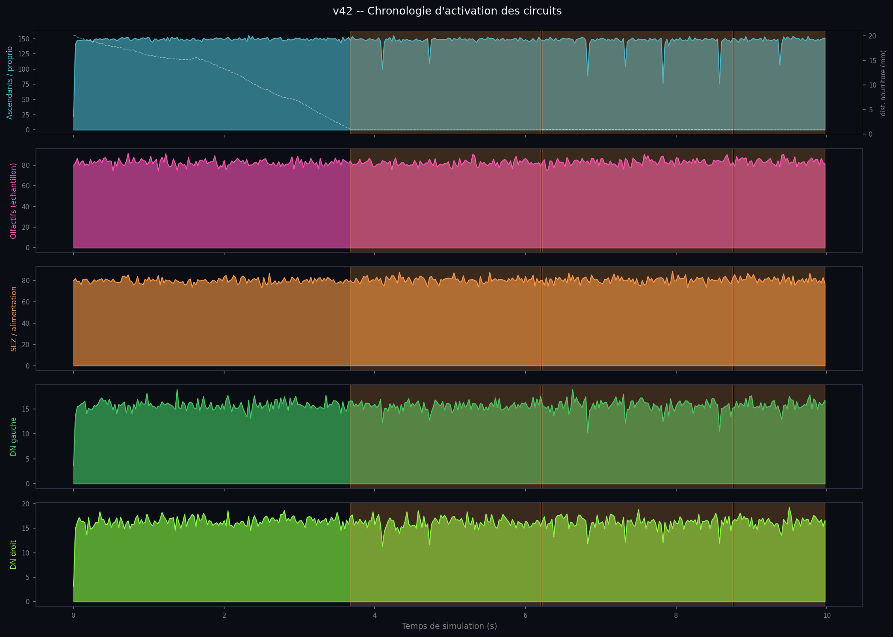

Taux de décharge moyen (Hz) pour chaque circuit sur les 10 secondes de simulation. La ligne pointillée blanche (axe droit) montre la distance à la nourriture. Les zones orangées indiquent les épisodes d'alimentation. On observe comment les circuits s'activent séquentiellement : les neurones ascendants encodent le mouvement en continu, les olfactifs s'intensifient à l'approche de la nourriture, et le SEZ s'active lors du contact.

#### 02 : Raster de spikes

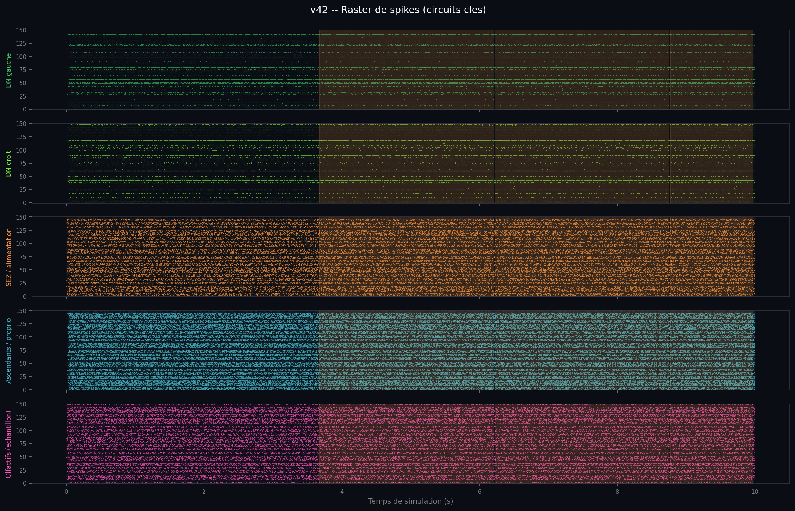

Chaque point représente un spike individuel (neurone × temps). Limité à 150 neurones par circuit pour la lisibilité. Permet de voir la variabilité inter-neuronale : certains neurones DN sont très actifs, d'autres silencieux. C'est le comportement caractéristique d'un réseau LIF avec connectivité hétérogène.

#### 03 : Neurones descendants vs sortie motrice

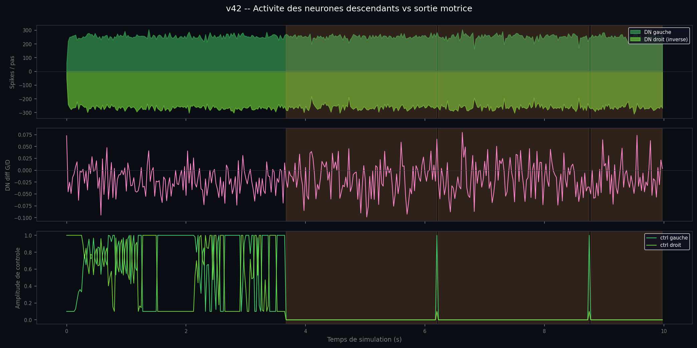

Trois panneaux superposés : comptage de spikes DN gauche/droit, asymétrie gauche-droite (lr_diff), et amplitudes de commande moteur. Visualise directement le lien cerveau→corps : une asymétrie DN se traduit par un différentiel de commande qui oriente la mouche.

#### 04 : Couplage en boucle fermée

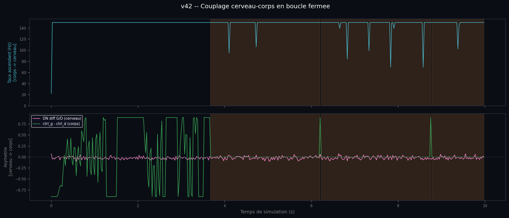

Les deux directions de la boucle fermée sur un seul graphique. Panneau supérieur : taux ascendant modulé par la cinématique des pattes (corps→cerveau). Panneau inférieur : asymétrie DN superposée au différentiel de commande moteur (cerveau→corps). Valide que les deux voies de rétroaction sont actives simultanément.

#### 05 : Carte de chaleur des populations

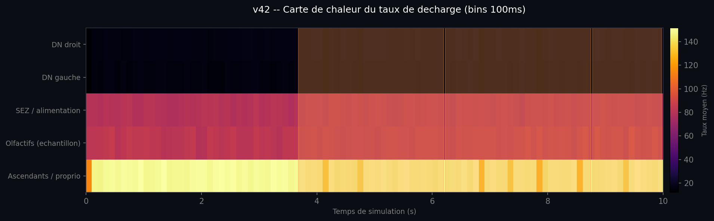

Densité de décharge binée à 100 ms pour chaque circuit, représentée en 2D (circuit × temps). La palette de couleurs inferno met en évidence les périodes d'activité intense. Donne une vue synthétique de la dynamique temporelle de l'ensemble du réseau d'un seul coup d'œil.

#### 06 : Distribution des taux de décharge

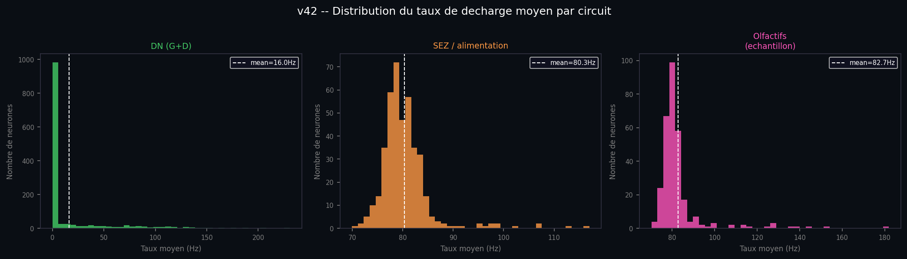

Histogramme du taux de décharge moyen sur 10 s pour chaque neurone dans les circuits DN, SEZ et olfactifs. Révèle la distribution hétérogène caractéristique d'un réseau LIF réaliste : majorité de neurones peu actifs avec une queue de neurones très actifs.

#### 07 : Gradient olfactif vs circuit olfactif

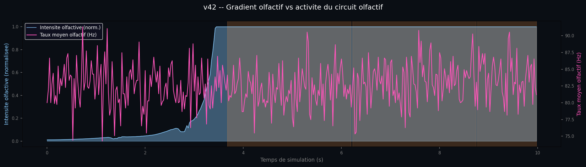

Intensité olfactive mesurée par les capteurs physiques (bleu) superposée au taux moyen du circuit olfactif Brian2 (rose). Valide que le signal sensoriel physique se propage bien jusqu'à l'activité neuronale, et que la couche olfactive s'embrase effectivement à l'approche de la source.

#### 08 : Luminance oculaire vs taux laminaire

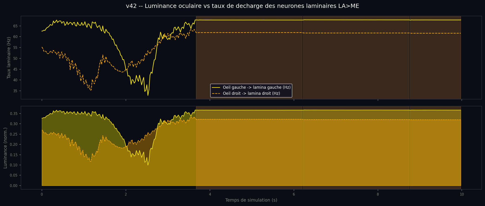

Deux panneaux. Haut : taux de décharge des neurones laminaires gauche et droit (Hz), pilotés par la luminance de l'oeil composé. Bas : luminance normalisée par oeil. Montre comment le signal visuel varie à l'approche et au passage des murs, fournissant le signal brut qui alimente le réseau T5 de flyvis.

#### 09 : Trajectoire XY avec disposition des murs

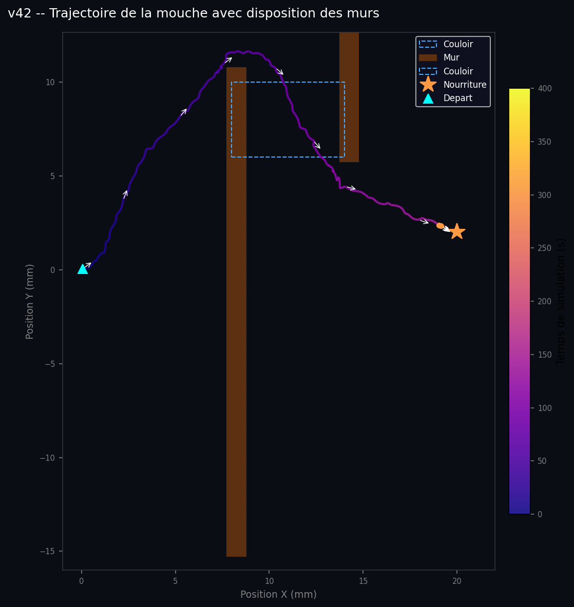

Trajectoire XY colorée selon le temps (palette plasma), flèches de cap toutes les 20 décisions, étoile pour la nourriture, triangle pour le point de départ. Les murs sont tracés depuis la grille `odor_field/blocked`, le couloir entre les deux murs est délimité par un rectangle bleu en pointillés. Les axes s'adaptent automatiquement à l'étendue de la trajectoire.

#### 10 : Réflexe T5 flyvis et biais de direction

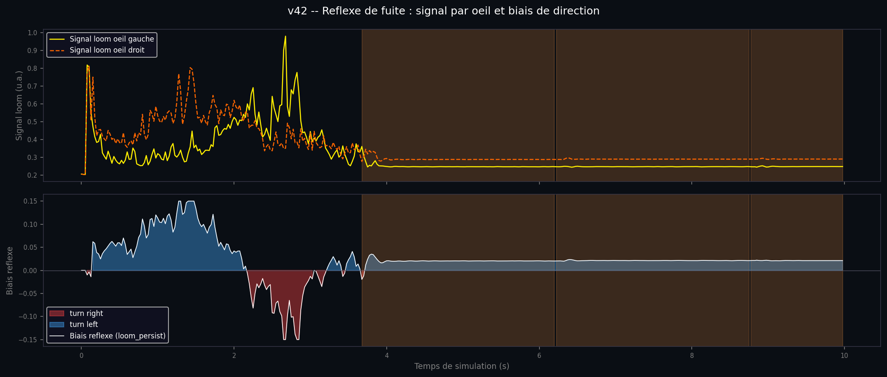

Deux panneaux. Haut : activité T5 des yeux gauche et droit au fil du temps (moyenne absolue T5a+T5b par oeil). Bas : remplissage loom_bias (rouge = virage droite, bleu = virage gauche), montrant comment le réflexe s'accumule puis se dissipe lors de l'approche du couloir.

#### 11 : Odeur antenne gauche vs droite et direction

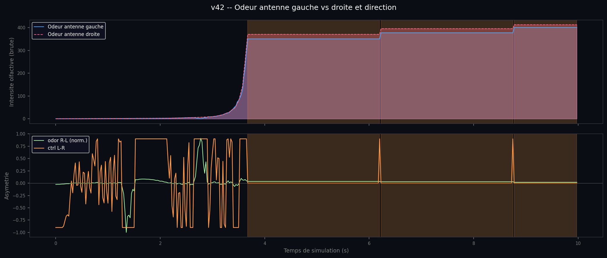

Deux panneaux. Haut : intensité olfactive brute aux antennes gauche et droite au fil du temps (champ Dijkstra canalisé, sans diffusion à travers les murs). Bas : asymétrie normalisée olfactive D-G superposée au signal de virage moteur.

#### 12 : Trajectoire sur carte d'odeur Dijkstra

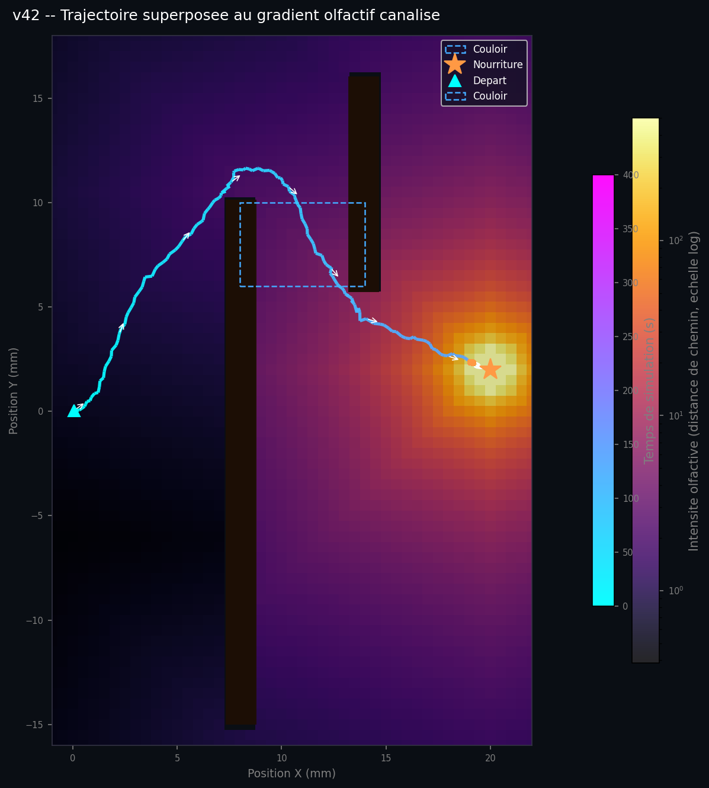

Chemin complet de la mouche superposé au champ d'odeur Dijkstra pré-calculé (palette inferno, échelle logarithmique). Les murs apparaissent en surimpression sombre depuis la grille de blocage. La trajectoire est colorée par la palette cool (bleu = début, cyan = fin), avec des flèches de cap toutes les 20 étapes. C'est la confirmation visuelle la plus directe que le gradient canalisé passe bien par les passages physiques plutôt qu'à travers les murs.

#### 13 : Corrélation odeur-mouvement

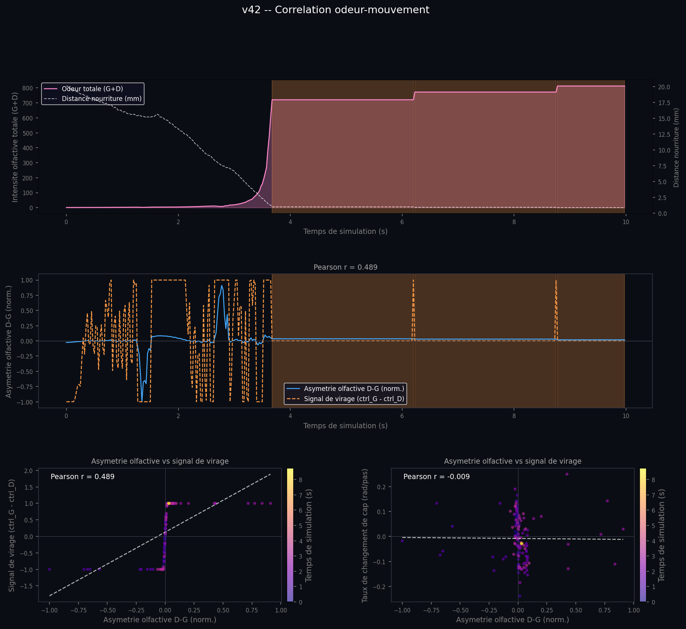

Quatre panneaux examinant le lien causal entre ce que la mouche sent et la façon dont elle se déplace. Haut : intensité olfactive totale et distance à la nourriture au cours du temps, révélant les zones de fort signal dans le couloir. Milieu : asymétrie olfactive signée (bleu) vs signal de virage normalisé (orange), avec le coefficient de Pearson en titre. Bas gauche : nuage de points asymétrie vs virage coloré par le temps, avec droite de régression. Bas droit : asymétrie olfactive vs vitesse de changement de cap à chaque pas, pour tester si le signal antennaire prédit la rotation réelle avant la traduction par le CPG. Les nuages de points excluent les étapes d'alimentation.

---

## Installation

### Prérequis système

- Windows 10 / 11 (64-bit)
- **Python 3.10** : requis exactement (flygym et Brian2 ont été validés sur 3.10)
  Télécharger : [python.org/downloads](https://www.python.org/downloads/release/python-31011/)
- **ffmpeg** : requis pour l'encodage vidéo
  Télécharger : [ffmpeg.org/download.html](https://ffmpeg.org/download.html) → ajouter au PATH

### Créer l'environnement virtuel

Ouvrir une invite de commandes dans le dossier du projet :

```bat
REM Créer le venv avec Python 3.10 spécifiquement
py -3.10 -m venv wenv310

REM Activer le venv
wenv310\Scripts\activate

REM Mettre à jour pip
python -m pip install --upgrade pip
```

### Installer les dépendances

```bat
pip install -r requirements.txt
```

> **Note** : `flybody` s'installe depuis GitHub. Git doit être installé et accessible dans le PATH.
> Télécharger git : [git-scm.com](https://git-scm.com/download/win)

### Configurer le backend C++ pour Brian2 (optionnel mais fortement recommandé, ×10 plus rapide)

Sans compilateur, la simulation tourne quand même via le backend numpy (`run.bat` bascule automatiquement). Avec le compilateur C++, l'exécution Brian2 passe de ~50 min à ~5 min.

#### Étape 1 : Installer Visual Studio 2022

Télécharger **Visual Studio 2022 Community** (gratuit) :
[visualstudio.microsoft.com/downloads](https://visualstudio.microsoft.com/downloads/)

Lors de l'installation, cocher la charge de travail :
**"Développement Desktop en C++"** (Desktop development with C++)

> Les **Build Tools** seuls suffisent si vous ne voulez pas l'IDE complet :
> [Télécharger Build Tools](https://visualstudio.microsoft.com/visual-cpp-build-tools/)

#### Étape 2 : Tester le compilateur

Ouvrir une **nouvelle** invite de commandes (pas PowerShell) et taper :

```bat
call "C:\Program Files\Microsoft Visual Studio\2022\Community\VC\Auxiliary\Build\vcvarsall.bat" x64
cl.exe
```

Résultat attendu (succès) :

```text
Microsoft (R) C/C++ Optimizing Compiler Version 19.xx...
```

Si vous obtenez `'cl' is not recognized` : vcvarsall.bat n'a pas été appelé, ou le composant C++ n'est pas installé.

#### Étape 3 : Tester Brian2 avec le backend C++

```bat
wenv310\Scripts\activate
call "C:\Program Files\Microsoft Visual Studio\2022\Community\VC\Auxiliary\Build\vcvarsall.bat" x64
python -c "from brian2 import *; G = NeuronGroup(1, 'dv/dt = -v/ms : 1'); net = Network(G); net.run(1*ms); print('SUCCESS C++ BACKEND')"
```

Si Brian2 compile avec Cython (premier run ~30 s) et affiche `SUCCESS C++ BACKEND`, le compilateur est opérationnel. `run.bat` le détectera automatiquement à chaque lancement.

---

## Exécution

### Option A : Docker (tous systèmes, aucune installation locale requise)

Si Docker n'est pas installé : [docs.docker.com/get-started/get-docker](https://docs.docker.com/get-started/get-docker/)

```bash
# Construire l'image (une seule fois, ~5–10 min)
docker build -t fly-brain-sim .

# Lancer - les résultats sont écrits dans simulations/, logs/, plots/ locaux
docker run --rm \
  -v $(pwd)/simulations:/app/simulations \
  -v $(pwd)/logs:/app/logs \
  -v $(pwd)/plots:/app/plots \
  fly-brain-sim
```

Sous Windows PowerShell, remplacer `$(pwd)` par `${PWD}`. Brian2 utilise GCC dans le conteneur, Visual Studio n'est pas nécessaire. Le premier lancement ajoute ~13 min de compilation Cython ; pour conserver le cache entre les exécutions, ajouter `-v brian2-cache:/root/.cython` à la commande.

### Option B : Windows natif (recommandé pour le développement)

**Méthode recommandée : utiliser le script de lancement** (configure automatiquement le compilateur C++) :

```bat
run.bat
```

Ou manuellement depuis une invite de commandes avec l'environnement VS :

```bat
call "C:\Program Files\Microsoft Visual Studio\2022\Community\VC\Auxiliary\Build\vcvarsall.bat" x64
wenv310\Scripts\python.exe fly_brain_body_simulation.py
```

**Choix des caméras** - paramètre `--cameras` avec 2 ou 3 noms (défaut : vue du dessus + caméra dorsale) :

```bat
REM Défaut : vue du dessus + caméra dorsale côte à côte
wenv310\Scripts\python.exe fly_brain_body_simulation.py --cameras camera_top_zoomout camera_back_close

REM 3 caméras : ajoute la vue isométrique en pleine largeur en bas
wenv310\Scripts\python.exe fly_brain_body_simulation.py --cameras camera_top_zoomout camera_back_close camera_top_right
```

Noms disponibles : `camera_top_zoomout` (vue du dessus), `camera_back_close` (caméra dorsale), `camera_top_right` (vue isométrique).

**Durée estimée : ~2h30-3h** avec le backend C++ (cache chaud). Le premier lancement absolu ajoute ~13 min de compilation C++ (Brian2 compile ~50M synapses en Cython/C++, une seule fois, puis mis en cache).

Coût mesuré par pas (machine de référence, 138k neurones, 50M synapses) :

| Étape | Temps par pas | Total (400 pas) |
| --- | --- | --- |
| `net.run(25ms)` Brian2 | ~20–30 s | ~130–180 min |
| Physique MuJoCo + rendu | ~0,5 s | ~3 min |
| Calcul glow + rendu cerveau | (après boucle) | ~10 min |
| Écriture vidéo | (après boucle) | ~2 min |
| **TOTAL** | | **~2h30–3h** |

Le log de progression en temps réel est écrit dans `logs/YYYY-MM-DD_HH-MM-SS_run.log` (stdout + stderr) :

```text
  step 000/400  t=0.00s  [walk]  proprio=0ms  brian=24557ms  physics=9320ms  step_total=33879ms  asc=22Hz  DN L51/R49 lr=+0.02  dist=21.6mm  ETA=225.3min
  step 010/400  t=0.25s  [walk]  proprio=0ms  brian=17696ms  physics=446ms   step_total=18142ms  asc=150Hz  DN L254/R248 lr=+0.01  dist=21.1mm  ETA=150.0min
  FEEDING START  t=2.30s  dist=1.18mm
  step 090/400  t=2.25s  [walk]  proprio=0ms  brian=21197ms  physics=521ms   step_total=21722ms  asc=150Hz  DN L264/R267 lr=-0.01  dist=1.6mm   ETA=122.0min
```

**Prérequis** : Visual Studio 2022 Community avec la charge de travail "Développement Desktop en C++". Le script `run.bat` appelle `vcvarsall.bat x64` avant Python, ce qui est requis pour que Brian2 trouve `cl.exe`. Sans cela, Brian2 revient silencieusement au backend numpy (~10x plus lent).

Pour revenir au backend numpy (sans compilateur), décommenter dans `fly_brain_body_simulation.py` :

```python
# from brian2 import prefs; prefs.codegen.target = "numpy"
```

> **Note Windows** : `flygym` / `dm_control` doit être importé **avant** `load_dotenv()`. Le `.env` définit `MUJOCO_GL=egl` (renderer GPU Linux). S'il est chargé en premier sous Windows, l'import échoue. L'ordre des imports dans le script est intentionnel.

---

## Architecture et pipeline

```text
[Données connectome FlyWire v783]
        │
        ▼
[1. Chargement : 138 639 neurones + annotations]
   Completeness_783.csv → index Brian2
   flywire_annotations.tsv → types cellulaires, positions soma
        │
        ▼
[2. Extraction des groupes de neurones]
   Avant tout filtrage de coordonnées soma :
   - ascending (1 736)  → stimulation Poisson @ 150 Hz
   - olfactory ORN/PN (2 279) → couche rose, alpha ∝ odeur
   - SEZ/feeding (408)  → couche orange, alpha ∝ alimentation
   - DNs (1 299)        → couche verte + readout moteur
        │
        ▼
[3. Run Brian2 LIF : 10 000 ms continus]
   138 639 neurones LIF, ~50M synapses, backend C++ (défaut)
   Ascending @ 150 Hz + olfactory/SEZ @ 80 Hz (deux groupes Poisson distincts)
   ~15 000–20 000 neurones s'activent au moins une fois
        │
        ▼
[4. Pré-calcul des frames de glow]
   300 frames @ 30 fps, décroissance exp. τ=80 ms
   frame_glows[300, 118 078], normalisé [0, 1]
        │
        ▼
[5. Construction de la simulation flygym]
   OdorArena (nourriture à [20,2,0] mm, intensité=1.0 factice)
   Champ d'odeur Dijkstra pré-calculé (grille 0,5 mm/cellule, murs bloquants)
   Deux murs solides : mur1 x=8 y=-15..10, mur2 x=14 y=6..16
   Fly spawn (0,0,0.2) cap nord-est (0,588 rad, ~34°)
   Caméras : configurées via --cameras (défaut : vue du dessus + caméra dorsale)
   Corps mocap proboscis (capsule bleue)
        │
        ▼
[6. Boucle physique : 400 décisions × 250 microsteps]
   Chaque décision (25 ms) :
     Odeur Dijkstra aux positions des antennes → biais de virage primaire
     lr_diff[t] des DNs → modulation cérébrale (×0.15)
     T5 flyvis → loom_bias (GAIN=0.5, BIAS_MAX=0.15) → assistance au virage
     dist < 1.2 mm → alimentation (probe extend→eat→retract)
     Messages [NAV] aux jalons + statut [ODR] toutes les 20 décisions
        │
        ▼
[7. Rendu des panneaux cérébraux : 1 200 frames]
   5 couches scatter empilées par frame :
     fond navy → activité LIF → DN vert → olfactif rose → SEZ orange
        │
        ▼
[8. Assemblage et encodage vidéo]
   Rangée 1 : panneau cerveau (1280×480)
   Rangée 2 : vue iso + vue du dessus (640×H chacune)
   Rangée 3 : 3e caméra en pleine largeur (1280×H) — si 3 caméras fournies
   h264, CRF 18, yuv420p
        │
        ▼
[9. Export des données de simulation : simulations/vN_data.h5]
   Format HDF5 (h5py, gzip) :
     /behavior  → séries temporelles comportementales (400 pas × 25 ms)
     /spikes    → trains de spikes par circuit (DN, SEZ, olfactif, ascendants)
     /positions → coordonnées soma pour chaque circuit
     /meta      → paramètres et métadonnées de la simulation
   Consommé par generate_plots.py → plots/vN/FR/ + plots/vN/EN/
```

---

## Le modèle cérébral : Brian2 LIF

### Source des données

Le connectome FlyWire v783 contient la carte complète de chaque neurone et synapse du cerveau adulte de *Drosophila melanogaster*, assemblée par microscopie électronique en transmission (TEM) par le projet FlyWire (Princeton, Janelia, UCL). Version 783 = 138 639 neurones, ~50 millions de synapses.

### Modèle neuronal Leaky Integrate-and-Fire

Chaque neurone est modélisé par deux équations différentielles :

```text
dv/dt = (v_0 - v + g) / t_mbr   [dynamique membranaire, "fuite" vers le repos]
dg/dt = -g / tau                  [décroissance de la conductance synaptique]
```

Quand `v` dépasse `v_th`, le neurone émet un spike et se réinitialise à `v_rst` pour une période réfractaire `t_rfc`.

### Paramètres LIF

| Paramètre | Valeur | Signification biologique |
| --- | --- | --- |
| `v_0` | -52 mV | Potentiel de repos (sans entrée, la tension revient ici) |
| `v_th` | -45 mV | Seuil de décharge (+7 mV au-dessus du repos) |
| `v_rst` | -52 mV | Réinitialisation post-spike |
| `t_mbr` | 20 ms | Constante de temps membranaire (vitesse de fuite) |
| `tau` | 5 ms | Décroissance de la conductance synaptique |
| `t_rfc` | 2.2 ms | Période réfractaire (durée minimale entre deux spikes) |
| `t_dly` | 1.8 ms | Délai de transmission synaptique |
| `w_syn` | 0.275 mV | Poids par synapse (contribution d'un spike entrant) |
| `r_poi` | 150 Hz | Taux de stimulation Poisson des neurones ascendants |
| `r_poi2` | 80 Hz | Taux de stimulation des neurones olfactifs (ORN/PN) et SEZ |

### Connectivité synaptique

Chaque synapse dans `Connectivity_783.parquet` a un signe encodé dans la colonne `Excitatory x Connectivity` :

- **Positif** → synapse excitatrice (augmente `g`, rapproche `v` du seuil)
- **Négatif** → synapse inhibitrice (diminue `g`, éloigne `v` du seuil)

Le poids effectif dans Brian2 : `w = (Excitatory x Connectivity) × w_syn`

### Choix des neurones stimulés

Les **neurones ascendants** sont choisis comme entrée car ils constituent le canal proprioceptif principal : ils transportent le signal "les pattes bougent" du corps vers le cerveau. L'analyse de connectivité montre qu'ils établissent 646 synapses directes sur des DNs de locomotion, atteignant 28 DNs distincts, bien plus que tout autre type sensoriel (neurones de l'organe de Johnston : 41 synapses sur 3 DNs seulement).

Leur taux de décharge est **dynamique** : à chaque fenêtre de 25 ms, la vitesse angulaire des pattes est calculée depuis `obs["joints"]` et encodée en taux Poisson entre `PROPRIO_MIN × 150 Hz` (immobilité) et `150 Hz` (marche rapide). Le cerveau reçoit ainsi un signal qui reflète l'état locomoteur réel de la mouche à chaque instant.

### Backend C++ (défaut)

Brian2 compile automatiquement les équations LIF vers C++ via Cython, **10x plus rapide** que le backend numpy pur Python. Sous Windows, cela requiert Visual Studio 2022 avec "Desktop development with C++" et l'environnement MSVC initialisé (`vcvarsall.bat x64`) avant le lancement de Python. Le script `run.bat` s'en charge automatiquement.

En cas de besoin, le backend numpy reste disponible :

```python
from brian2 import prefs; prefs.codegen.target = "numpy"
```

Note : cette ligne doit être placée **avant toute création d'objet Brian2**.

### Positions soma pour la visualisation

Les neurones sont affichés à leurs coordonnées anatomiques réelles :

- Axes utilisés : `soma_x` (gauche-droite) vs `soma_y` inversé (dorsal-ventral)
- `soma_z` est l'axe de profondeur en 40 nm/vox, trop plat pour servir d'axe vertical
- Les neurones sans `soma_x/y` (olfactifs, SEZ) utilisent `pos_x/y` (centroïde cellulaire) comme repli, couverture 100%

---

## Le modèle corporel : NeuroMechFly

### Spécifications du modèle MuJoCo

| Propriété | Valeur |
| --- | --- |
| Degrés de liberté totaux | 87 articulations |
| Articulations par patte | 7 (Coxa, Coxa_roll, Coxa_yaw, Femur, Femur_roll, Tibia, Tarsus1) |
| Articulations de pattes | 42 (6 pattes × 7 DOF) |
| Capteurs olfactifs | 4 (antenne gauche/droite + palpe gauche/droite) |
| Coussinets adhésifs | Activés |
| Pas de temps physique | 0.1 ms (1e-4 s) |
| Gravité | -9810 mm/s² |

### HybridTurningController

Le contrôleur principal reçoit un signal 2D à chaque pas de 25 ms :

```python
obs, reward, terminated, truncated, info = sim.step([left_amp, right_amp])
# left_amp, right_amp ∈ [0, 1]
```

En interne, il :

1. Définit les amplitudes du CPGNetwork (6 oscillateurs couplés, un par patte)
2. Produit l'allure tripode : Tripode A (LF, RM, RH) et Tripode B (RF, LM, LH) en opposition de phase
3. Applique les règles de trébuchement et rétraction (stabilité sur terrain irrégulier)
4. Appelle `physics.step()` (1 microstep MuJoCo = 0.1 ms)

**Mécanisme de virage** : réduire l'amplitude d'un côté ralentit ce tripode → la mouche courbe vers ce côté.

### Capteurs olfactifs

`obs["odor_intensity"]` → shape `(1, 4)` → `[ant_gauche, ant_droite, palpe_gauche, palpe_droite]`

La concentration décroît en loi inverse du carré : `C(r) = peak_intensity / r²`. Avec `peak_intensity = 500`, l'odeur atteint ~2 à 15 mm, ~100 à 7 mm, ~1 500 à moins de 2 mm de la source.

---

## Interface cerveau-corps

C'est le cœur du projet. Les neurones descendants (DNs) sont les **seuls câbles biologiques** reliant le cerveau au système moteur.

### Signal moteur des DNs

Le run Brian2 de 10 s est découpé en 400 fenêtres de 25 ms (une par décision physique) :

```python
bin_edges = np.linspace(0.0, 10.0, 401)   # 400 fenêtres de 25 ms

left_rate[t]  = Σ spikes DNs gauches dans la fenêtre t
right_rate[t] = Σ spikes DNs droits dans la fenêtre t
```

Asymétrie gauche/droite :

```python
lr_diff[t] = (left_rate[t] - right_rate[t]) / (left_rate[t] + right_rate[t] + ε)
# Plage [-1, 1]
```

### Calcul du signal de contrôle

Le virage est principalement guidé par l'odeur, avec une modulation cérébrale subtile :

```python
# Guidage olfactif (signal principal)
lr_asym   = (right_odor - left_odor) / (total_odor + ε)
odor_turn = np.tanh(lr_asym * 20.0) * ODOR_TURN_K   # ODOR_TURN_K = 2.5

# Modulation cérébrale (variation biologique)
dn_bias = lr_diff[t] * 0.15

turn_bias = odor_turn + dn_bias
left_amp  = clip(WALK_AMP + turn_bias, 0.1, 1.0)
right_amp = clip(WALK_AMP - turn_bias, 0.1, 1.0)
```

Le `np.tanh` amplifie les petites asymétries d'odeur (signal faible à longue distance) en un virage décisif. Le facteur `×0.15` sur le biais DN garantit que le cerveau influence la trajectoire sans écraser le signal olfactif.

---

## Visualisation cérébrale

### Système de glow à décroissance exponentielle

Pour chaque frame vidéo, un vecteur de glow `[n_neurons]` est calculé :

```python
glow *= exp(-FRAME_DT_MS / DECAY_TAU_MS)   # décroissance τ=80 ms
glow[spiked_neurons] += 1.0                 # spike → boost instantané
```

Le glow est normalisé sur le pic global puis appliqué comme taille et couleur de chaque point scatter.

### Cinq couches superposées par frame

| Couche | Neurones | Couleur | Comportement |
| --- | --- | --- | --- |
| Fond | 138 617 | Navy `#1a3a5c` | Statique, anatomie toujours visible |
| LIF | 138 617 | Cyan → blanc | Glow ∝ activité de spike individuelle |
| DN | 1 299 | Vert vif | Alpha fixe 0.75, vmax=0.25 (petits spikes → vert vif) |
| Olfactif | 2 279 | Rose/magenta | Stimulés @ 80 Hz dans Brian2 ; alpha ∝ intensité d'odeur |
| SEZ | 408 | Orange | Stimulés @ 80 Hz dans Brian2 ; alpha ∝ phase d'alimentation |

Les neurones olfactifs (ORN/PN, 2 279) et SEZ/alimentation (408) reçoivent leur propre groupe de stimulation Poisson dans Brian2 (`exc2` @ 80 Hz), séparé des neurones ascendants (150 Hz). Cela leur donne de **vrais trains de spikes individuels** : chaque neurone décharge à sa propre fréquence selon ses connexions synaptiques. L'alpha de la couche est modulé par l'état comportemental (intensité d'odeur ou phase d'alimentation) pour refléter la pertinence contextuelle.

---

## Comportement de navigation et d'alimentation

### Parcours en zigzag dans le couloir

La mouche traverse un couloir physique formé de deux murs avant d'atteindre la nourriture. Les murs sont des géométries solides MuJoCo avec des paramètres de contact souples (solimp/solref) pour éviter les instabilités dues aux actionneurs d'adhésion. Le champ d'odeur est pré-calculé par l'algorithme de Dijkstra sur une grille de plus court chemin praticable, de sorte que le gradient contourne les murs plutôt que de les traverser.

**Jalons de navigation** (affichés une seule fois chacun) :

1. Marcher nord-est depuis le spawn, approcher le mur 1 à x=8 mm
2. Trouver le passage à y>=10 (nord du mur 1) et le franchir
3. Entrer dans le couloir (x=8..14, y=6..10)
4. Trouver le passage à y<=6 (sud du mur 2) et franchir x=14 mm
5. Continuer vers la nourriture à (20, 2, 0)

**Apport du réflexe T5 flyvis** : le détecteur de mouvement T5, contraint par le connectome, se déclenche de façon asymétrique lorsque la surface d'un mur occupe davantage l'un des yeux. Avec GAIN=0,5 et BIAS_MAX=0,15, il procure une légère impulsion vers le passage sans provoquer de surcompensation. Les conditions B (murs + T5 flyvis) et C (murs, odeur seule) atteignent toutes deux la nourriture vers le pas 145, contre 156 pour A (sans murs).

### Chronologie typique

| Temps physique | Comportement | Neurones actifs |
| --- | --- | --- |
| 0–1,5 s | Marche nord-est vers le mur 1 | DN (vert) |
| ~1,5 s | Franchit le passage y>=10, entre dans le couloir | DN + olfactif (rose) |
| ~2–3 s | Traverse le couloir, trouve le passage y<=6 | DN + olfactif (rose) |
| ~3–3,5 s | Au-delà du mur 2, cap vers la nourriture (20, 2) | DN + olfactif (rose) |
| ~3,5 s | Dist < 1.2 mm → alimentation | DN + olfactif + SEZ (orange) |
| ~3,5–4 s | Proboscis s'étend | SEZ (orange) |
| ~4–6 s | Alimentation active | SEZ (orange) |
| ~6–6,5 s | Proboscis se rétracte | SEZ (orange) |
| ~6,5 s | Reprend la marche | DN (vert) |

### Proboscis (sonde bleue)

Le proboscis est simulé par un corps mocap MuJoCo (capsule bleue) positionné entre le `0/Haustellum` (bout de la bouche à ~[0.58, 0, 1.20] mm) et la nourriture. L'orientation est calculée par quaternion de rotation de l'axe Z vers la direction `food_pos - haustellum_pos`. La longueur extension suit une courbe en S via un timer normalisé.

---

## Paramètres clés

Toutes les constantes réglables sont en haut de `fly_brain_body_simulation.py` :

| Paramètre | Défaut | Effet |
| --- | --- | --- |
| `PHYS_DURATION_S` | 10.0 s | Durée physique + cérébrale (identiques) |
| `PLAY_SPEED` | 0.25 | Ralenti 4x (10 s physique = 40 s vidéo) |
| `STIM_RATE_HZ` | 150 Hz | Stimulation Poisson des neurones ascendants |
| `FOOD_POS` | [20, 2, 0] mm | Position de la nourriture (au sud du passage mur 2) |
| `GRID_RES` | 0,5 mm | Résolution de la grille d'odeur Dijkstra |
| `ANT_SEP` | 0,5 mm | Ecartement latéral des antennes pour l'échantillonnage |
| `FEED_DIST` | 1.2 mm | Seuil de distance pour déclencher l'alimentation |
| `FEED_DUR` | 2.0 s | Durée de la phase d'alimentation active |
| `ODOR_TURN_K` | 2.5 | Force du virage olfactif |
| `WALK_AMP` | 0.75 | Amplitude de marche de base [0-1] |
| `DECAY_TAU_MS` | 80 ms | Constante de décroissance du glow cérébral |
| `DECISION_INTERVAL` | 0.025 s | Durée d'une fenêtre de contrôle (25 ms) |
| `FLYVIS_T5_GAIN` | 0.5 | Gain du réflexe T5 flyvis (faible pour éviter la surcompensation) |
| `FLYVIS_DECAY` | 0.5 | Décroissance exponentielle du biais T5 par pas |
| `FLYVIS_BIAS_MAX` | 0.15 | Plafond du biais de virage T5 (assiste l'odeur sans la dominer) |

---

## Structure du dépôt

```text
fly_brain_simulation/
├── fly_brain_body_simulation.py   # pipeline complet, point d'entrée unique
├── generate_plots.py              # graphiques d'analyse depuis les données HDF5
├── run.bat                        # script de lancement (détecte automatiquement le compilateur C++)
├── brain_model/
│   ├── model.py                   # constructeur réseau LIF Brian2 (create_model, poi)
│   ├── Completeness_783.csv       # index 138 639 neurones (FlyWire v783)
│   ├── Connectivity_783.parquet   # table synapses (~50M lignes)
│   ├── flywire_annotations.tsv    # types cellulaires + coordonnées soma/pos
│   └── descending_neurons.csv     # 1 299 DNs avec côté latéral
├── simulations/
│   ├── preview.gif                # aperçu v1
│   ├── preview2.gif               # aperçu v4
│   └── vN_brain_body_v4.mp4       # vidéos versionnées
├── tests/
│   ├── test_flyvis_stateful_timing.py   # accélération 174x du forward() stateful confirmée
│   ├── test_fly_body_height.py          # centre de masse z=−0.36mm, base mur < −0.4mm
│   ├── test_wall_heading0588.py         # couloir en zigzag, 3 conditions atteignent la nourriture
│   ├── test_solid_wall_stability.py     # corrections BADQACC pour géométries solides
│   └── test_vision_sensor.py            # caractérisation de obs["vision"]
├── .env                           # MUJOCO_GL=egl (renderer GPU)
├── CLAUDE.md                      # instructions pour Claude Code
└── README.md                      # ce fichier
```

---

## Dépendances

Toutes pré-installées dans `wenv310/` (Python 3.10, Windows) :

| Paquet | Version | Rôle |
| --- | --- | --- |
| `brian2` | ≥2.5 | Simulation réseau LIF |
| `flygym` | 1.2.1 | NeuroMechFly + MuJoCo |
| `dm_control` | latest | Bindings MuJoCo DeepMind |
| `mujoco` | latest | Moteur physique |
| `numpy` | latest | Calcul matriciel |
| `pandas` | latest | Chargement connectome |
| `matplotlib` | latest | Rendu panneau cérébral |
| `scipy` | latest | Quaternions (orientation proboscis) |
| `imageio` | latest | Encodage vidéo |
| `python-dotenv` | latest | Config `.env` |

---

## Base scientifique

**Modèle cérébral** : basé sur [philshiu/Drosophila_brain_model](https://github.com/philshiu/Drosophila_brain_model) :
> Shiu et al. (2023). *A leaky integrate-and-fire computational model based on the connectome of the entire adult Drosophila brain reveals insights into sensorimotor processing.* PLOS Computational Biology.
> DOI : [10.1371/journal.pcbi.1011280](https://doi.org/10.1371/journal.pcbi.1011280)

**Connectome FlyWire v783** : [flywire.ai](https://flywire.ai) :
> Dorkenwald et al. (2024). *Neuronal wiring diagram of an adult brain.* Nature.
> DOI : [10.1038/s41586-024-07558-y](https://doi.org/10.1038/s41586-024-07558-y)
>
> Schlegel et al. (2024). *Whole-brain annotation and multi-connectome cell typing quantifies circuit stereotypy in Drosophila.* Nature.
> DOI : [10.1038/s41586-024-07686-5](https://doi.org/10.1038/s41586-024-07686-5)

**Modèle corporel NeuroMechFly v2** : [neuromechfly.org](https://neuromechfly.org) | [flygym/flygym](https://github.com/NeuromechFly/flygym) :
> Lobato-Rios et al. (2023). *NeuroMechFly 2.0, a framework for simulating embodied sensorimotor control in adult Drosophila.* Nature Methods.
> DOI : [10.1038/s41592-024-02497-y](https://doi.org/10.1038/s41592-024-02497-y)

**Moteur physique MuJoCo** : [mujoco.org](https://mujoco.org) | [google-deepmind/mujoco](https://github.com/google-deepmind/mujoco) :
> Todorov et al. (2012). *MuJoCo: A physics engine for model-based control.* IROS.
> DOI : [10.1109/IROS.2012.6386109](https://doi.org/10.1109/IROS.2012.6386109)

**Brian2** : [brian2.readthedocs.io](https://brian2.readthedocs.io) | [brian-team/brian2](https://github.com/brian-team/brian2) :
> Stimberg et al. (2019). *Brian 2, an intuitive and efficient neural simulator.* eLife.
> DOI : [10.7554/eLife.47314](https://doi.org/10.7554/eLife.47314)

---

## Limitations et perspectives

### 1. VNC non modélisé : problème de recherche ouvert

**Cause** : pas un manque de données. Le connectome du VNC (*Ventral Nerve Cord*, équivalent de la moelle épinière) a été partiellement mappé par FlyWire. Le problème est **l'intégration** : le VNC contient ~70 000 neurones supplémentaires incluant les CPGs (générateurs de rythme centraux) qui produisent réellement les commandes individuelles pour chaque articulation de patte. Connecter correctement ces ~70 000 neurones VNC aux 87 DOF du modèle MuJoCo (en respectant la topographie neuronale et les types moteurs) est un problème de recherche ouvert que personne n'a encore résolu. Nous contournons avec le CPGNetwork de flygym qui génère directement l'allure tripode depuis un signal 2D grossier.

**Prochaine étape** : intégrer le connectome VNC de Janelia (*FANC*, 2023) et mapper les neurones moteurs annotés aux DOF MuJoCo correspondants.

### 2. Retour proprioceptif : ✅ implémenté

**Ce qu'on avait** : les neurones ascendants recevaient un bruit Poisson **uniforme et constant** à 150 Hz pendant toute la durée du run Brian2 (10 s d'un bloc). Le cerveau "entendait" toujours le même signal quelle que soit l'activité de la mouche, que la mouche marche ou s'arrête pour manger : les 1 736 neurones ascendants déchargeaient de la même façon. C'était biologiquement inexact : en réalité, les propriocepteurs des pattes cessent de décharger quand les pattes sont immobiles.

**L'autre problème architectural** : Brian2 tournait entièrement en amont, avant la simulation physique. Il était donc impossible de lire l'état des pattes et de le renvoyer vers le cerveau ; il n'y avait pas de boucle, seulement deux pipelines séquentiels.

**Ce qu'on a changé** :

1. **Architecture entrelacée** : au lieu d'un seul `net.run(10 000 ms)`, la boucle physique appelle maintenant `net.run(25 ms)` à chaque décision. Brian2 et MuJoCo avancent en synchronie, pas l'un après l'autre.

2. **`PoissonInput` → `PoissonGroup`** : `PoissonInput` en Brian2 a un taux fixé à la création, non modifiable entre les runs. On est passé à `PoissonGroup`, dont l'attribut `rates` est un tableau numpy qu'on peut écraser entre chaque pas de 25 ms.

3. **Encodage vitesse → taux** : à chaque décision, on calcule `delta = obs["joints"] - prev_joints`, puis `velocity = ||delta|| / dt`. On normalise par `MAX_JOINT_VELOCITY = 8.0 rad/s` et on mappe vers :

   ```text
   r = SENSORY_STIM_RATE × (PROPRIO_MIN + (1 − PROPRIO_MIN) × clamp(velocity / max, 0, 1))
   ```

   soit entre `0.15 × 150 Hz = 22 Hz` (immobilité totale) et `150 Hz` (marche rapide).

**Effet biologique observé** :

- Pendant la **marche** : pattes bougent rapidement → taux ascendant proche de 150 Hz → le cerveau reçoit un fort signal de locomotion, les DNs s'activent.
- Pendant l'**alimentation** : pattes quasi-immobiles → taux chute vers ~22 Hz → l'activité ascendante diminue, ce qui est cohérent avec le comportement réel de la drosophile qui cesse tout mouvement de pattes pendant le repas.
- La **sortie DN** est maintenant **causale** : elle reflète le vrai état neural au moment de la décision, pas un signal pré-calculé sur une simulation déconnectée.

### 3. Joints de la bouche supprimés : limitation du modèle flygym

**Cause** : décision de conception de l'équipe NeuroMechFly. Leur modèle XML (`neuromechfly_seqik_kinorder_ypr.xml`) inclut la géométrie du proboscis (`0/Haustellum`, `0/Rostrum`, `0/Labrum`) mais ces corps sont des géométries fixes sans joints ni actionneurs. Ils ont été intentionnellement exclus car les études de locomotion ne nécessitent pas d'articulation buccale.

**Ce qui existe** : les corps et géométries 3D sont présents (visibles dans MuJoCo viewer). Les positions (`xpos`) sont accessibles. Seuls les joints manquent dans le modèle compilé.

**Solutions possibles** :

- Modifier le XML source de flygym et réinstaller le package : risqué (peut casser la validation `HybridTurningController`)
- Créer une sous-classe `FlyWithMouth(Fly)` qui surcharge `_add_joint_actuators` : architecturalement propre mais `HybridTurningController` valide strictement `actuated_joints == all_leg_dofs`
- Approche actuelle (mocap) : corps mocap positionné manuellement via `physics.data.mocap_pos`, aucune physique, mais visuellement convaincant

### 4. Stimulation cérébrale contextuelle : ✅ résolue par le retour proprioceptif

**Ce qu'on avait** : les neurones ascendants étaient stimulés à taux constant (150 Hz Poisson) pendant toute la durée du run, indépendamment du comportement. Le cerveau produisait un signal de locomotion continu même pendant les phases d'alimentation où la mouche est immobile. La modulation comportementale (rose/orange) était calculée depuis le signal physique, pas depuis le cerveau ; les deux pipelines étaient découplés.

**Ce qui est résolu** : grâce au retour proprioceptif (limitation #2), le taux de stimulation des neurones ascendants varie maintenant avec l'état locomoteur réel. Pendant l'alimentation, les pattes cessent de bouger, la vitesse articulaire tombe à ~0, et le taux Poisson chute à ~22 Hz. Le cerveau reçoit un signal différent selon que la mouche marche ou mange ; la modulation comportementale émerge naturellement de la dynamique neurale, pas d'une règle codée en dur.

### 5. Performance : backend C++ activé ✅

Le backend C++ est désormais opérationnel. Visual Studio 2022 Community avec "Desktop development with C++" est installé, et le script `run.bat` configure automatiquement l'environnement MSVC. Le run de 10 s prend **~5 min** (Brian2 seul) au lieu de ~50 min avec numpy.

Le backend numpy reste disponible en commentant une ligne dans le script : utile si Visual Studio n'est pas installé sur une autre machine.

---

## Positionnement dans l'écosystème open source

À notre connaissance, **aucun projet open source public ne combine les trois couches** de cette simulation (connectome complet + physique du corps + boucle sensorielle fermée) pour *Drosophila*. Voici l'état de l'art :

### Projets existants : cerveau seul

- **[philshiu/Drosophila_brain_model](https://github.com/philshiu/Drosophila_brain_model)** : le modèle Brian2 LIF sur le connectome FlyWire que nous utilisons. Pas de corps.
  > Shiu et al. (2023). PLOS Computational Biology.

- **[FlyWire](https://flywire.ai)** : l'atlas connectomique complet. Données et outil d'annotation, pas de simulation.
  > Dorkenwald et al. (2024). Nature.

### Projets existants : corps seul

- **[flygym/flygym](https://github.com/NeuromechFly/flygym)** : NeuroMechFly v2, simulation physique du corps avec locomotion CPG, olfaction, vision. Pas de cerveau connectomique.
  > Lobato-Rios et al. (2023). Nature Methods.

### L'analogue le plus proche : autre organisme

- **[OpenWorm](https://openworm.org)** : simulation complète cerveau + corps de *C. elegans* (ver nématode). Architecture conceptuellement identique à ce projet : les 302 neurones du connectome pilotent un corps physique en boucle fermée. Open source depuis 2011, projet de référence mondial.
  > Code source : [github.com/openworm](https://github.com/openworm)

### Ce qui n'existe pas encore publiquement

La combinaison **connectome Drosophila complet (138 639 neurones) → corps physique 3D → retour sensoriel en boucle fermée** n'a pas été publiée en open source. Des prototypes internes existent dans certains laboratoires (Janelia Research Campus, Princeton Neuroscience Institute, groupe FlyWire) mais aucun n'est accessible au public sous forme intégrée.

### Ce que ce projet apporte

| Couche | Ce projet | État de l'art public |
| --- | --- | --- |
| Cerveau LIF sur connectome réel | ✅ 138 639 neurones, 10 s continus | ✅ philshiu (1 s, pas de corps) |
| Corps physique 3D MuJoCo | ✅ NeuroMechFly, 87 DOF | ✅ flygym (pas de cerveau) |
| Navigation olfactive connectée au cerveau | ✅ ORN/PN stimulés @ 80 Hz Brian2 | ❌ flygym (corps seul, pas de cerveau) |
| Comportement alimentaire (SEZ) | ✅ proboscis + SEZ stimulé @ 80 Hz | ❌ pas de projet public |
| Visualisation circuits en temps réel | ✅ 5 couches colorées (cyan/vert/rose/orange) | ❌ pas de projet public |
| Backend C++ Brian2 | ✅ Visual Studio 2022, ~5 min/run | ✅ standard sur Linux |
| Boucle sensorielle fermée (proprio) | ✅ corps → cerveau via vitesse articulaire | ❌ pas de projet public |

La boucle est maintenant entièrement fermée : le cerveau influence le corps (via les DNs), et le corps influence le cerveau (via le retour proprioceptif des neurones ascendants). Auparavant, les deux pipelines tournaient séquentiellement sans échange : Brian2 d'abord, physique ensuite. La refonte en architecture entrelacée (400 × 25 ms) a rendu ce retour possible.

---

## Motivations et directions futures

### Origine du projet

Ce projet a été directement inspiré par les travaux d'**EON Systems PBC**, une entreprise qui travaille sur l'émulation cerveau-corps. Début 2025, le co-fondateur **Dr. Alex Wissner-Gross** a partagé une vidéo montrant une simulation du cerveau de *Drosophila* à connectome complet pilotant un corps physique - la première démonstration publique de ce type que j'avais vue. Constater que c'était possible, et que les outils sous-jacents (connectome FlyWire, Brian2, NeuroMechFly) étaient tous open source, est ce qui m'a poussé à construire une implémentation indépendante.

- Annonce EON Systems : [eon.systems/updates/weve-uploaded-a-fruit-fly](https://eon.systems/updates/weve-uploaded-a-fruit-fly)
- Description technique : [eon.systems/updates/embodied-brain-emulation](https://eon.systems/updates/embodied-brain-emulation)
- Vidéo partagée par le Dr. Wissner-Gross : [youtube.com/watch?v=e21OUXPlnhk](https://www.youtube.com/watch?v=e21OUXPlnhk)

Ce projet est une réimplémentation indépendante, sans affiliation avec EON Systems ni approbation de leur part. Tout le code a été écrit à partir de zéro en utilisant les mêmes jeux de données publics et bibliothèques open source.

### Contexte personnel

Je suis ingénieur logiciel et je vis avec la Sclérose en Plaques. Cette combinaison - un intérêt personnel pour la compréhension de la démyélinisation et les compétences techniques pour construire des outils computationnels - est la raison directe pour laquelle ce projet existe.

La question initiale était simple : serait-il possible d'assembler des outils open source publiquement disponibles (un vrai connectome, un simulateur physique, un framework de réseau de neurones à décharges) en une simulation cerveau-corps fonctionnelle en boucle fermée, entièrement sur du matériel grand public, sans ressources institutionnelles ? Ce projet est la réponse : une implémentation solo construite sur un ordinateur portable milieu de gamme, intégrant FlyWire, Brian2 et NeuroMechFly en un seul pipeline.

Trois motivations l'ont guidé :

1. **Investissement personnel** : la SEP est la condition que je voulais comprendre de manière computationnelle. La possibilité d'observer comment une perturbation de circuits se propage à travers un vrai connectome, en simulation, est ce qui a lancé le projet.
2. **Apprendre en construisant** : en tant qu'ingénieur logiciel sans formation formelle en neurosciences, c'était une façon d'apprendre les neurosciences computationnelles en les pratiquant : réseaux à décharges, physique MuJoCo, backends de compilation C++, formats de données de connectome, le tout en même temps.
3. **Accessibilité** : les simulations neuronales à grande échelle tournent presque toujours sur des clusters de calcul. Un objectif concret de ce projet était de démontrer qu'une simulation biologiquement fondée, à connectome complet, en boucle fermée, peut tourner sur un ordinateur personnel au-dessus de la moyenne (ici : une exécution de ~2,5–3 heures sur un ordinateur portable Windows avec un GPU milieu de gamme et le compilateur C++ de Visual Studio). Aucun supercalculateur, aucun compte institutionnel requis.

---

### Pourquoi la Sclérose en Plaques ne peut pas être modélisée chez *Drosophila*

Malgré la motivation personnelle, la SEP a dû être exclue comme cible de simulation après examen de la biologie.

**L'incompatibilité biologique est fondamentale.** La SEP est une maladie auto-immune démyélinisante spécifique aux vertébrés. Elle dépend des gaines de myéline produites par les oligodendrocytes, de l'immunité adaptative (lymphocytes T et B) et de la rupture de la barrière hémato-encéphalique ; aucun de ces éléments n'existe chez *Drosophila*. Les mouches à fruits n'ont pas de myéline.

Ce n'est pas une limitation de modélisation contournable. C'est un fait biologique confirmé par la littérature scientifique :

- Bhatt et al. (2007). *"The fruit fly does not synthesize myelin in its CNS."* EMBO Reports. [PMC2660653](https://pmc.ncbi.nlm.nih.gov/articles/PMC2660653/)
- Nave & Trapp (2008). *Axon-glial signaling and the glial support of axon function.* Annual Review of Neuroscience. [10.1146/annurev.neuro.31.060407.125533](https://doi.org/10.1146/annurev.neuro.31.060407.125533)
- Gould & Morrison (2008). *Evolutionary and medical perspectives on the myelin proteome.* Journal of Neuroscience Research. [10.1002/jnr.21647](https://doi.org/10.1002/jnr.21647)

Des recherches bibliographiques approfondies ("FlyWire connectome MS", "Drosophila multiple sclerosis", "fly brain demyelination") n'ont retourné aucun résultat pertinent. *Drosophila* est utilisée pour certaines maladies neurodégénératives (modèles SLA, Alzheimer, Parkinson) mais pas pour la SEP. La recherche sur la SEP utilise des modèles vertébrés, principalement l'EAE murine (encéphalomyélite auto-immune expérimentale), ou des modèles computationnels de progression de la maladie basés sur l'IRM humaine.

---

### Prochaine étape : vers une simulation du cerveau mammifère

La progression naturelle de ce projet est d'appliquer la même architecture en boucle fermée à des données neuronales de mammifères. Le jeu de données public le plus prometteur à cet effet est **MICrONS** (Machine Intelligence from Cortical Networks), un projet commun de l'Allen Institute, du Baylor College of Medicine et de l'Université de Princeton.

**Ce que MICrONS fournit :**
> *"Un millimètre cube de cortex visuel de souris, reconstruit à résolution nanométrique : ~100 000 neurones et ~1 milliard de synapses."*
> MICrONS Consortium (2021). *Functional connectomics spanning multiple areas of mouse visual cortex.* bioRxiv. [10.1101/2021.07.28.454025](https://doi.org/10.1101/2021.07.28.454025)

Données et outils : [microns-explorer.org](https://www.microns-explorer.org) | [github.com/seung-lab/MICrONS](https://github.com/seung-lab/MICrONS)

**Le défi fondamental : la complexité morphologique :**

Un neurone mammifère n'est pas un neurone d'insecte agrandi. Les différences sont structurelles et quantitatives :

| Propriété | Neurone *Drosophila* (FlyWire) | Neurone cortical de souris (MICrONS) |
| --- | --- | --- |
| Arbre dendritique | Simple, compact | Très ramifié, centaines de µm |
| Synapses par neurone | ~370 en moyenne | ~5 000–10 000 en moyenne |
| Reconstruction morphologique | ~1 Mo/neurone | ~100–500 Mo/neurone |
| Taille totale du connectome | ~1 Go (FlyWire) | ~1,3 **pétaoctets** (EM brut MICrONS) |
| Modélisation compartimentale nécessaire | Non (neurone ponctuel suffisant) | Oui (les dendrites importent computationnellement) |

Le jeu de données MICrONS est un projet à l'échelle du pétaoctet précisément parce que la morphologie de chaque neurone mammifère (son arbre dendritique, la densité des épines, la ramification axonale) doit être reconstruite à résolution nanométrique pour cartographier les synapses avec précision. Un modèle LIF à neurone ponctuel (comme utilisé ici) perd les propriétés computationnelles qui émergent de l'intégration dendritique dans les cellules pyramidales.

**Ce qu'une simulation du cerveau mammifère nécessiterait au-delà de ce projet :**

1. **Modèles de neurones compartimentaux** (p. ex. Hodgkin-Huxley multi-compartiments ou modèles câble simplifiés) plutôt qu'un LIF ponctuel
2. **Un corps physique** : aucun équivalent de NeuroMechFly n'existe encore pour la souris ; c'est un problème ouvert
3. **Simulation de sous-graphe sélectif** : même un patch de 1 mm³ à pleine résolution ne peut pas tourner en temps réel sur du matériel grand public ; un sous-échantillonnage ou des modèles de population abstraits seraient nécessaires
4. **La modélisation des maladies devient possible** : contrairement à *Drosophila*, un modèle cortical de souris peut inclure la myéline, la glie et des perturbations de circuits liées à l'immunité, rendant des conditions comme la SEP, la SLA ou l'épilepsie directement adressables

L'objectif reste le même que pour ce projet : faire tourner la simulation sur un ordinateur personnel. La voie n'est pas d'attendre un cluster ; c'est le sous-échantillonnage intelligent, des approximations neuronales ponctuelles efficaces du calcul dendritique, et l'extraction de sous-graphes sélectifs depuis des jeux de données publics comme MICrONS, CAVE et le Human Connectome Project. Les données sont déjà publiques. Le défi est de rendre la simulation réalisable à l'échelle grand public.

---

## Attributions

Ce projet ne serait pas possible sans le travail des équipes suivantes. Tout le code scientifique de base (connectome, modèle LIF, simulation physique, moteur physique) provient de ces projets open source.

### Connectome FlyWire v783

- **FlyWire** : [flywire.ai](https://flywire.ai) | [Princeton FlyWire GitHub](https://github.com/seung-lab/cloud-volume)
  Carte complète du cerveau adulte de *Drosophila* par microscopie électronique en transmission. 138 639 neurones, ~50 millions de synapses. Les fichiers `Completeness_783.csv`, `Connectivity_783.parquet` et `flywire_annotations.tsv` utilisés ici en sont issus.
  > Dorkenwald et al. (2024). *Neuronal wiring diagram of an adult brain.* Nature. [10.1038/s41586-024-07558-y](https://doi.org/10.1038/s41586-024-07558-y)
  > Schlegel et al. (2024). *Whole-brain annotation and multi-connectome cell typing.* Nature. [10.1038/s41586-024-07686-5](https://doi.org/10.1038/s41586-024-07686-5)

### Modèle LIF sur connectome Drosophila

- **philshiu/Drosophila_brain_model** : [github.com/philshiu/Drosophila_brain_model](https://github.com/philshiu/Drosophila_brain_model)
  Implémentation Brian2 du réseau LIF sur le connectome FlyWire. Le fichier `brain_model/model.py` (`create_model`, `poi`, `default_params`) est directement dérivé de ce dépôt.
  > Shiu et al. (2023). *A leaky integrate-and-fire computational model based on the connectome of the entire adult Drosophila brain.* PLOS Computational Biology. [10.1371/journal.pcbi.1011280](https://doi.org/10.1371/journal.pcbi.1011280)

### Simulation corporelle NeuroMechFly

- **flygym/flygym** : [github.com/NeuromechFly/flygym](https://github.com/NeuromechFly/flygym) | [neuromechfly.org](https://neuromechfly.org)
  Framework Python pour la simulation sensorimotrice de *Drosophila* adulte. Fournit `HybridTurningController`, `OdorArena`, `Fly`, `YawOnlyCamera` utilisés dans ce projet.
  > Lobato-Rios et al. (2023). *NeuroMechFly 2.0, a framework for simulating embodied sensorimotor control in adult Drosophila.* Nature Methods. [10.1038/s41592-024-02497-y](https://doi.org/10.1038/s41592-024-02497-y)

- **TuragaLab/flybody** : [github.com/TuragaLab/flybody](https://github.com/TuragaLab/flybody)
  Dépendance de flygym fournissant le modèle MuJoCo XML de la mouche et les utilitaires de contrôle bas niveau.

### Moteur physique MuJoCo

- **google-deepmind/mujoco** : [github.com/google-deepmind/mujoco](https://github.com/google-deepmind/mujoco) | [mujoco.org](https://mujoco.org)
  Moteur de simulation physique à base de contraintes. Gère les 87 DOF, la détection de contact, les coussinets adhésifs et les corps mocap utilisés pour le proboscis.
  > Todorov et al. (2012). *MuJoCo: A physics engine for model-based control.* IROS. [10.1109/IROS.2012.6386109](https://doi.org/10.1109/IROS.2012.6386109)

### Simulateur de réseau de neurones Brian2

- **brian-team/brian2** : [github.com/brian-team/brian2](https://github.com/brian-team/brian2) | [brian2.readthedocs.io](https://brian2.readthedocs.io)
  Simulateur Python de réseaux de neurones à décharges. Utilisé pour les 138 639 neurones LIF, les synapses avec délai, et les groupes Poisson dynamiques pour le retour proprioceptif.
  > Stimberg et al. (2019). *Brian 2, an intuitive and efficient neural simulator.* eLife. [10.7554/eLife.47314](https://doi.org/10.7554/eLife.47314)

### Référence conceptuelle : simulation cerveau-corps complète

- **OpenWorm** : [openworm.org](https://openworm.org) | [github.com/openworm](https://github.com/openworm)
  Premier projet open source à avoir réalisé une simulation cerveau-corps complète pour *C. elegans* (302 neurones). Référence conceptuelle pour l'architecture de ce projet.
